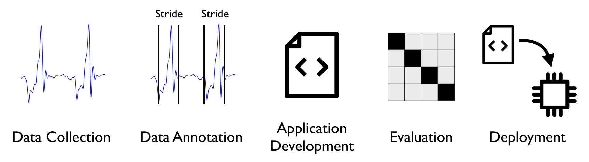
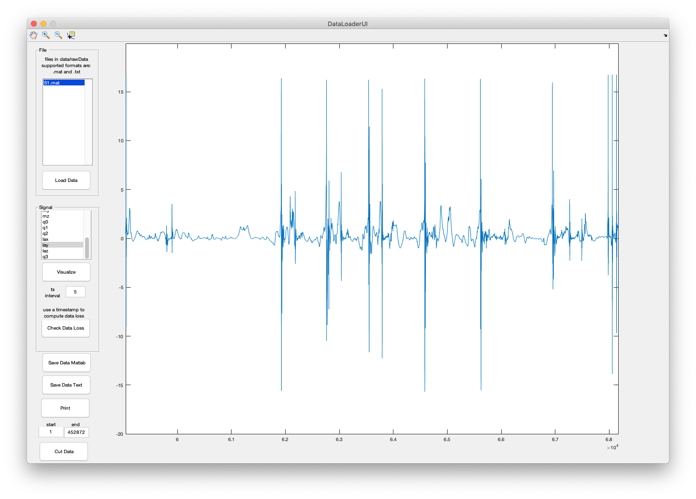
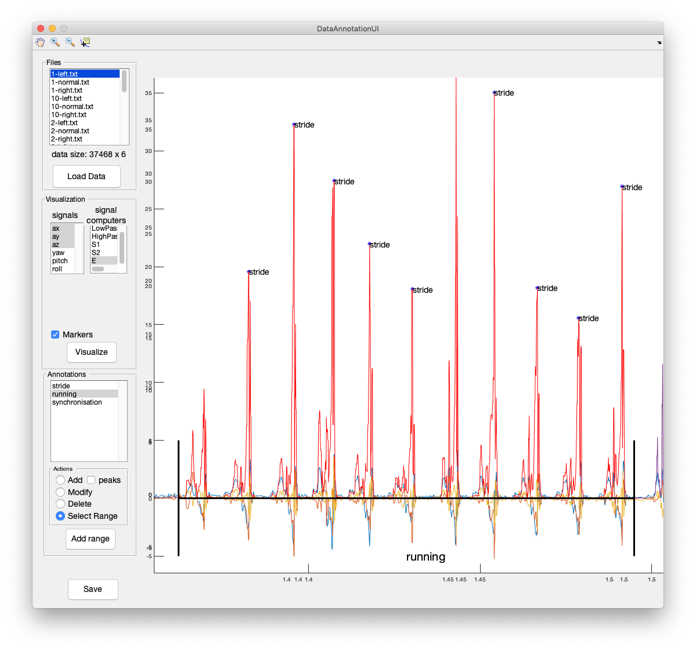
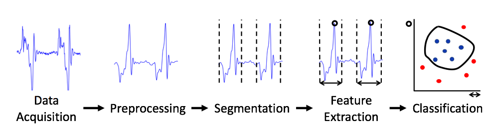

# Wearables Development Toolkit

This toolkit facilitates the development of wearable device applications. The usual activities involved in the development of such applications are: data collection, data annotation, algorithm development, algorithm evaluation and deployment (i.e. integration of the code into the wearable device): 

 This Toolkit offers different tools for each of these activities.

*Note: Check my Matlab tutorial on the Activity Recognition Chain for wearables: <https://github.com/avenix/ARC-Tutorial/>*

## Data Collection

Once you have collected data you can use the *DataLoaderApp* in *0-DataLoader* to do a first check on the data and convert it to Matlab's binary format, used by the rest of the toolkit. 

*Note: the DataLoader can load any file in comma separated format.*
*Note: by default, the DataLoaderApp will load data files from the ./data/rawdata/ directory*

## Data Annotation

To train the wearable application to recognize a specific pattern and to test whether it works as expected, you need to annotate the data you collected. The *DataAnnotationApp* offers functionality to annotate time series data.  Depending on your application, you will want to annotate sudden events or activities that have a duration in time. The *DataAnnotationApp* supports both kinds of annotations.

It might be hard to annotate time series data without a reference. The *DataAnnotationApp* can import and display reference markers on top of the time series data. Currently, the *DataAnnotationApp* supports markers created with the video annotation tool [DaVinciResolve](https://www.blackmagicdesign.com/products/davinciresolve/) in *.edl* format.

In order to display markers on top of the time series data, the markers need to be aligned (synchronised) to the time series data. In order to do this, your markers *.edl* file should contain a marker in green color in the beginning and another one in the end of the file. These markers will be automatically matched to the first and last annotation with the label *synchronisaton'. This is the typical annotation flow:

1. Annotate the video using DaVinci Resolve. Use a green marker to annotate a special event, ideally in the beginning and end of the file. (e.g. the user shakes the sensor three times in front of the camera).
2. Export the markers to an *.edl* file. This can be done by: right click on the Timeline, timelines, export, Timeline markers to .EDL...
3. Copy the markers to the *data/markers/* directory.
4. Open the *DataAnnotationApp* and annotate the special events using the *synchronisation* class.
5. Reopen the *DataAnnotationApp*. This time the markers should be properly aligned with the data. You can now use  these markers to annotate the rest of the data.

*Note: by default, the DataAnnotationApp will load annotation files from the ./data/annotations/ directory. Saved annotation files will be stored in the root './' directory*.
*Note: markers in .edl format will be read from the ./data/markers directory*.

## Application Development

Most wearable device applications follow the Activity Recognition Chain:

### Preprocessing
to come...

## Setup
* install Matlab
* `git clone git@github.com:avenix/ARC-Tutorial.git`
* in Matlab, `addpath(genpath('./'))`
* open the App file in each directory (e.g. *DataAnnotationApp* in *1-DataAnnotation*).
 
## References
You will find more information about the human activity recognition on Andreas Bulling's article: https://dl.acm.org/citation.cfm?id=2499621

A few example applications:
1. https://www.mdpi.com/2414-4088/2/2/27
2. https://dl.acm.org/citation.cfm?id=3267267

## Contact
Juan Haladjian
haladjia@in.tum.de
