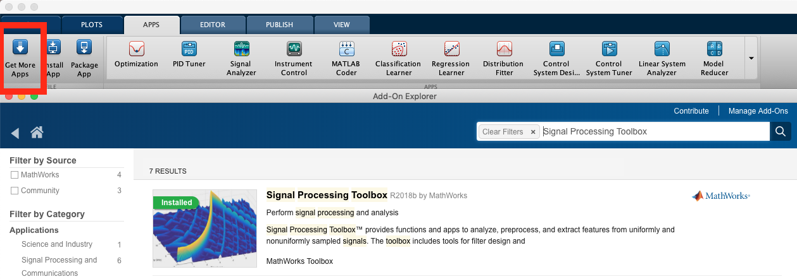
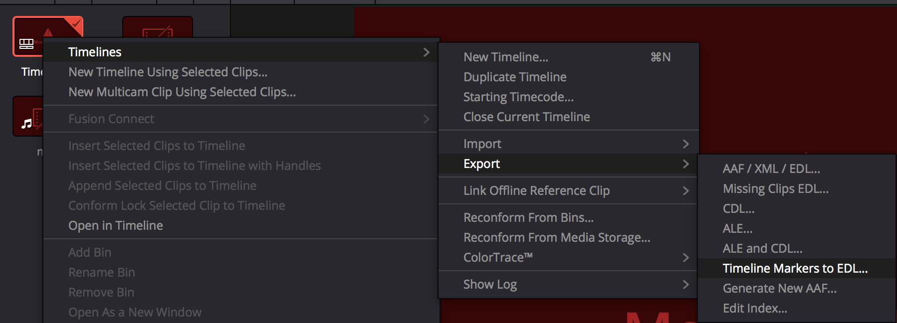

# Wearables Development Toolkit

The Warables Development Toolkit facilitates the development of wearable device applications. The usual activities involved in the development of such applications are: data collection, data annotation, algorithm development, algorithm evaluation and deployment (i.e. integration of the code into the wearable device): 


 This Toolkit offers different tools for each of these activities.

*Note: Check my Matlab tutorial on the Activity Recognition Chain for wearables: <https://github.com/avenix/ARC-Tutorial/>*

## Setup

* install Matlab. 
* `git clone git@github.com:avenix/ARC-Tutorial.git`
* in Matlab, `addpath(genpath('./'))`
* enjoy the Apps in each directory (e.g. *DataAnnotationApp* in *1-DataAnnotation/*).

The WDK requires the installation of the Signal Processing Toolbox:



*Note: When running the toolkit for the first time, ensure the Constants.m file points to the right data/ directory.*

*Note: to avoid issues with pathing, always stay at the root directory of the repository. You can check your matlab directory as shown in red in the following image* 


### Data Structure

The *Constants.m* file defines the following path constants:

```
classesPath = './data/classes.txt';
annotationsPath = './data/annotations';
markersPath = './data/markers';
dataPath = './data/rawdata';
precomputedPath = './data/cache';
labelingStrategiesPath = './data/labeling';
```
- Make sure these paths point to the right directory in your filesystem.
- List the classes of your particular application in the *classes.txt* file.

## Data Collection

Once you have data available for analysis, you can use the *DataLoaderApp* in *0-DataLoader* to do a first check on the data and convert it to Matlab's binary format, used by the rest of the toolkit.


*Note: the DataLoader can load any file in comma separated format.*
*Note: by default, the DataLoaderApp will load data files from the ./data/rawdata/ directory*

## Data Annotation

An annotated data set is needed to train a machine learning algorithm and to assess its performance. The *DataAnnotationApp* offers functionality to annotate time series data. Depending on the particular application, you will want to annotate specific events or activities that have a duration in time. The *DataAnnotationApp* supports both kinds of annotations.

It might be cumbersome to annotate time series data without a reference. The *DataAnnotationApp* can import and display markers on top of the time series data. Currently, the *DataAnnotationApp* supports marker files created with the video annotation tool [DaVinciResolve](https://www.blackmagicdesign.com/products/davinciresolve/) in *.edl* format. Markers added to a timeline in DaVinciResolve can be exported by: right-clicking on the Timeline, timelines, export, Timeline markers to .EDL..., as shown in the image below:



Before the markers can be displayed properly on top of the time series data, they need to be synchronised to the time series data. In order to do this, the *.edl* file should contain a marker in green color in the beginning and another one in the end of the file. These markers will be automatically matched to the first and last annotation labeled as *synchronisaton'. This is the typical annotation flow:

1. Annotate the video using DaVinci Resolve. Use a green marker to annotate a special event, ideally in the beginning and end of the file. (e.g. the user shakes the sensor three times in front of the camera).
2. Export the markers to an *.edl* file.
3. Copy the *.edl* file to the *data/markers/* directory.
4. Open the *DataAnnotationApp* and annotate the special events using the *synchronisation* class.
5. Reopen the *DataAnnotationApp*. This time the markers should be properly aligned with the data.
6. Annotate the time series data.


*Note: by default, the DataAnnotationApp will load annotation files from the ./data/annotations/ directory. Saved annotation files will be stored in the root './' directory*.

*Note: markers in .edl format will be read from the ./data/markers directory*.

*Note: in order to be able to annotate a data set, the classes should have previously been defined in the ./data/classes.txt file*

## Application Development

Most wearable device applications execute a chain of computations in order to detect specific patterns based on sensor signals. This chain of computations is called the Activity Recognition Chain:


### Preprocessing

The *SignalExplorerApp* can be used to display and compare the signals corresponding to different classes. The *SignalExplorerApp* can also compute different signal processing methods commonly used on wearable applications. After a preprocessing and segmentation strategy have been chosen, the *SignalExplorerApp* plots every segment of each selected class on top of each other. 

Currently, the following signal processing methods are supported:

Filters:
- HighPassFilter: Butterworth high-pass filter
- LowPassFilter: Butterworth low-pass filter

Energy:
- EnergyComputer: 
- NormComputer: 
- S1Computer: computes 
- S2Computer: computes 


### Feature Extraction

The *FeatureExtractor* class extracts the following time-domain features:

- Statistical features: mean, standard deviation, variance, maximum, minimum, correlation.
- Cross correlation: a measure of the similarity between two waveforms. It calculates the dot product between the signal and a shifted version of another signal.
- Correlaton coefficients (also called Pearson correlation coefficients): cov(x,y) / (std(x)*std(y).
- DC component: the first component of the frequency domain representation of a signal.
- SVM: signal vector magnitude (normalized). The sum of the magnitude.
- SMA: Signal Magnitude Area. Similar to AUC, but easier to compute.
- quantile(signal,n): the cutpoints dividing a set of values into n+1 segments. quantile(signal,2) sorts the values in the signal and dividides them in three groups and returns the two cutpoints separating the three groups.
- entropy: gives an indication of the amount of information in a signal. More information leads to less entropy. Flipping a coin has high entropy of 1. If there is 100 / 0% probability that an event will occur, the entropy is 0.
- kurtosis: describes the tailedness of the distribution of values in the signal.
- skewness: describes the distribution of values with respect to the mean. A positive skewness indicates that most values in the segment are concentrated at the left of the distribution and there is a tail on the right.
- IQR: interquartile range. The difference between the median of Q3 and Q1 where Q3 and Q1 are intervals separated by the median of the data set. Indicates variability in the signal.
- MAD: mean absolute deviation.
- AAV: average absolute acceleration variation.
- trapz: The area under the signal's curve integrated numerically with the trapezoid method
- ZRC: zero crossing rate: how often a signal crosses the 0 threshold:
TODO. Check the zero crossing using the mean as sample
- RMS: root mean square
- duration: the number of samples in the segment (makes sense if the segmentaton produced segments with different amounts of samples)

and the following frequency-domain features:

- spectral spread: indicates the variance in the distribution of frequencies.
- spectral centroid: Indicates where the "center of mass" of the spectrum is located.
- spectral flatness: provides a way to quantify how noise-like a sound is. White noise has peaks in all frequencies making its spectrum look flat.
- spectral entropy: indicates how chaotic / how much informatiomn there is in the frequency distribution.
- spectral energy: the energy of the frequency domain (sum of squared values of dft coefficients).
- spectral density: the probability distribution of the spectrum. Not a feature but a transformation that can result in other features.

Coming soon: Frequency domain features (maximum frequency, value and ratio, spectral entropy, 10 cepstral coefficients, Fourier transform: coefficients grouped in four logarithmic bands, maximum spectral frequency ), wavelet analysis, mean crossing rate.

*Note: use the extractFeatures() method of the FeatureExtractor. This method receives a *Segment* as input and returns i) an array of features and ii) an array with the name of each feature in i)*.
 
 ## Getting started
1. Place your data files (.txt or .mat) in the *./data/rawdata/* directory
2. If the files are in *.txt* format, you might want to convert them to a binary format with the *DataLoaderApp*
3. Define your classes in the *classes.txt* file. 
4. Open the *DataAnnotationApp* to annotate your data. Annotations created with the App should be copied into the *./data/annotations*
5. Sometimes we will want to group annotations for the data analysis. For example, we might want to consider events annotated as *low jump*, *mid jump* and *high jump* as a *jump* for a first data analysis. This can be achieved by defining a labeling strategy. A labeling strategy maps annotations made to groups, which is provided in the following *.txt* format: 
```
#Group1 
class1
class2
class3

#Group2
class4
class5
```
Note that you dont need to assign every class to a group. A class which is left ungrouped will be assigned to its own group automatically. Ensure that the classes you provide have been defined in the *./data/classes.txt* file and that no class belongs to two groups at the same time. Place your labeling strategy files in the *./data/labeling/*
6. The WDK offers a Matlab App to support you in each stage of the development your wearable applications. Check in each directory for the App file.

## Tipps

* The default data paths can be changed in the *Constants* class.  
 
 ## Troubleshooting

> 'Error - no labeling strategy available'.

Check the *./data/labeling/* directory. There might be no *.txt* file containing a labeling strategy.

> 'Error. Invalid annotation class'. 

An annotation file in *./data/annotations/* contains an invalid label (i.e. a class which is not listed in the *./data/classes.txt* file)  

> 'Error. class not defined'
 
 The *ClassesMap* triggers this error when it is requested to map a string of an invalid class. This error might be due to a file in the  *./data/labeling/* directory containing an invalid class name.
 
 > 'Warning - FeatureSelector - every segment has same value. Feature selection might fail';
 
 The current version of the *FeatureSelector* uses the mRMR algorithm to select the most relevant features. The mRMR algorithm will fail if every value of a feature is the same.

* The data in the *./data/rawData* directory should be consistent. You will get errors if different files have different amount of columns. 
* Double-check that the *./data/annotations/* directory contains an annotation file for each data file in *./data/rawdata/*.  

## References
You will find more information about the human activity recognition on Andreas Bulling's article: https://dl.acm.org/citation.cfm?id=2499621

A few example applications:
1. https://www.mdpi.com/2414-4088/2/2/27
2. https://dl.acm.org/citation.cfm?id=3267267

* [Peak detection algorithms by Palshikar](http://constans.pbworks.com/w/file/fetch/120908295/Simple_Algorithms_for_Peak_Detection_in_Time-Serie.pdf)
* [mRMR feature selection by Peng](http://home.penglab.com/proj/mRMR/)

## Contact
Juan Haladjian
haladjia@in.tum.de
