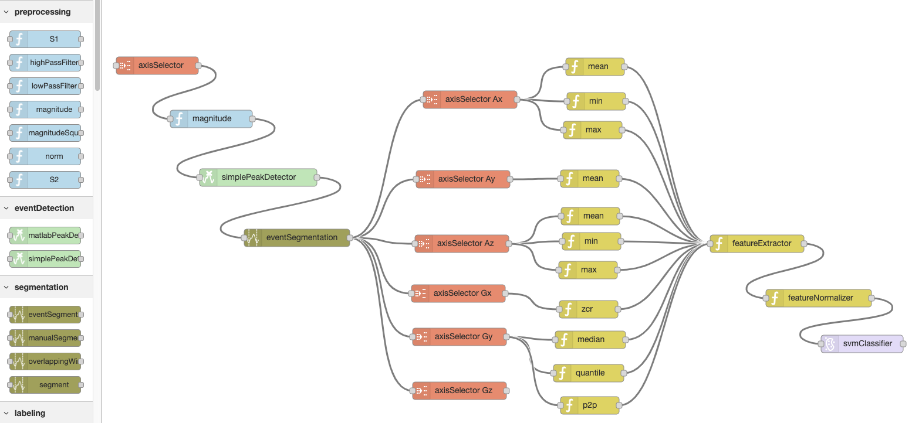

# Wearables Development Toolkit (WDK)

The Wearables Development Toolkit (WDK) is a set of tools to facilitate the development of wearable device / activity recognition applications. The usual activities involved in the development of such applications are: data collection, data annotation, algorithm development, algorithm evaluation and deployment (i.e. integration of the code into the wearable device): 


## Setup

* ```git clone https://github.com/avenix/WDK.git```
* install Matlab 2018b or greater. 
* in Matlab, open the repository and type:  `addpath(genpath('./'))` in the console
* this code uses the mRMR library for feature selection. If you get an error '*estpab function not found*', then you need to:
```
cd libraries/mRMR_0.9/mi/
mex -setup C++ 
makeosmex
```
* use the Apps in each directory (e.g. *AnnotationApp* in *1-Annotation/*).
* install the [Signal Processing Toolbox](https://www.mathworks.com/products/signal.html) by clicking on the *Get More Apps* button on Matlab's toolbar.
* to avoid issues with pathing, Matlab's current path should be set to the root of the WDK directory: 


* the '*./data*' directory should contain the following files and directories defined in the *Constants.m* file:

```
kLabelsPath = './data/annotations/labels.txt';
kAnnotationsPath = './data/annotations';
kMarkersPath = './data/markers';
kDataPath = './data/rawdata';
kCachePath = './data/cache';
kLabelGroupingsPath = './data/labeling';
kARChainsPath = './data/ARChains';
kVideosPath = './data/videos';
```
## Data Collection

The *DataConversionApp* can be used to do a first check on the data after its collection. It offers the following features:
- Load any tabularized *.txt* data file and save it to the binary format used by the rest of the toolkit.
- Check whether there has been data loss using a user-specified timestamp signal and sampling interval.
- Visualize the different signals.

*Note: by default, the DataLoaderApp loads data files from the ./data/rawdata/ directory. Converted files are saved to the ./ root directory.*

## Data Annotation

An annotated data set is needed to train a machine learning algorithm and to assess its performance. The *Data Annotation App* offers functionality to annotate time series data. Depending on the particular application, one might want to annotate *events* that occurr at a specific moment in time or activities that have a duration in time, called *ranges*. The following image shows the squared magnitude of the accelerometer signal collected by a motion sensor attached at a hind leg of a cow. The individual strides of the cow have been annotated as event annotations (red) and the walking and running activities as ranges (black rectangles).


### Annotating with video (optional)

The *Data Annotation App* can load and display videos next to the data. The video is synchronised to the data by matching two data samples to two video frames as defined in a synchronisation file. The format of a synchronisation file is:

```
sample1: 49727
sample2: 450209
frame1: 3302
frame2: 45284
```

The exact frames of a specific event in a video can be found by iterating the video frame by frame. The current video frame is shown at the bottom right of the window:


In this application, we asked the subject to applaud three times in front of the camera while wearing an armband with an Inertial Measurement Unit (IMU). We visualized the peak energy (i.e. squared magnitude) of the accelerometer signal and annotated each applause with the *synchronisation* label. When a data samples is selected on the plot, its timestamp is printed on Matlab's console. We copy the first synchronisation timestamp to the sample1 field of the synchronisation file. We do the same for the sample with timestamp *450209*. The respective annotated synchronisation events are shown in the following image:


Please note:

1. The AnnotationApp synchronises video and data at two points and interpolates linearly inbetween. We recommend the synchronisation points to take place in the beginning and end of a recording session.*
2. Annotation, marker, synchronisation and video files should be consistent with the data files. If a data file is named 'S1.mat', its annotation file should be named 'S1-annotations.txt', its marker file 'S1-markers.edl', its synchronisation file 'S1-synchronisation.txt' and the video 'S1-video.extension'.
3. By default, the *Data Annotation App* loads annotation files from the './data/annotations/', video and synchronisation files from './data/videos' directory. Saved annotation files are located in the root './' directory.
4. The labels to annotate should be defined in the 'labels.txt' file beforehand.
5. You can use the keyboard shortcuts arrow-right, arrow-left and spacebar to iterate through data and video.

### Importing external markers (optional)
The *Data Annotation App* can import and display reference markers on top of the time series data. Currently, the *Data Annotation App* supports marker files created with the video annotation tool [DaVinciResolve](https://www.blackmagicdesign.com/products/davinciresolve/) in *.edl* format. Markers added to a timeline in DaVinciResolve can be exported by: right-clicking on the *Timeline -> timelines -> export -> Timeline markers to .EDL...*:


Before the markers can be displayed properly on top of the time series data, they need to be synchronised to the time series data. In order to do this, the *.edl* file should contain a synchronisation marker in the beginning and another one in the end of the file. Currently, the first and last green marker are matched to the first and last event annotation of the class *synchronisaton*. In order to annotate data:

1. Annotate the video using DaVinci Resolve. Use a green marker to annotate a special event, ideally in the beginning and end of the file. (e.g. the user shakes the sensor three times in front of the camera).
2. Export the markers to an *.edl* file.
3. Copy the *.edl* file to the *data/markers/* directory.
4. Open the *Data Annotation App* and add an event annotation of the class *synchronisation* to the timestamp that corresponds .
5. Reopen the *Data Annotation App*. This time the markers should be properly aligned with the data.
6. Annotate the time series data.

*Note: markers in .edl format are read from the './data/markers' directory*.

## Data Visualization
The *Data Visualization App* displays segments of data grouped by class. This is useful to study the differences across classes (e.g. to design an event detection or feature extraction algorithm). Segments can be plotted either on top of each other or sequentially (i.e. after each other). In order to visualize data:

1. Select one or more input data files.
2. Select where the segments should come from. *Manual annotations* creates segments from the range annotations and loads event annotations to create segments using the *ManualSegmentationStrategy*. The *Automatic segmentation* uses a preprocessing, event detection and segmentation algorithms selected over the user interface to create segments.
3. (in Automatic segmentation mode) Select the signals to use, a preprocessing algorithm and (optionally) an event detection algorithm.
4. Select a segmentation strategy and (optionally) a grouping strategy. Click the *Create* button. At this point the segments are created.
6. Select signals and classes to visualize and a plot style (i.e. overlapping or sequential). 


## Application Development

Most wearable device applications execute a chain (i.e. sequence) of computations in order to detect specific patterns based on sensor signals. This chain of computations is called the Activity Recognition Chain and consists of the following *stages*:


Applications in the WDK can be developed visually over [WDK-RED](https://github.com/avenix/WDK-RED), via the user interface provided by the different WDK Apps, or directly via code. 

### Visual Programming

Activity recognition applications can be developed visually in Node-RED using the nodes available in the [WDK-RED platform](https://github.com/avenix/wearable-prototyping). The following image shows an activity recognition chain for detecting and classifying soccer goalkeeper training exercises using a wearable motion sensor attached to a glove worn by a goalkeeper:



Activity Recognition Chains can be imported and executed in the WDK as follows:

- Export the Activity Recognition Chains as described [here](https://github.com/avenix/WDK-RED#exporting).
- Execute the *convertJSONToWDK.m* script.
- Use the *Execute from File* button in each App.


### Text-based Programming

Activity recognition applications can be developed directly in Matlab as long as the WDK is in Matlab's path. The *Computer* class is the superclass of every reusable component. Every *Computer* has the following properties and methods:

```Matlab
inputPort; %type of the input this computer takes
outputPort; %type of the output this computer produces
nextComputers; %array of computers this computer is connected to
output = compute(obj,input); %the method executed when this computer is visited (implemented in each subclass) 
```

The following text snippet creates a chain of computations and saves it to the *goalkeeperChain.mat* file. This chain of computations detects events using a peak detector on the squared magnitude (sometimes called *energy*) of the accelerometer signal, segments the data around the detected events (200 samples to the left of the event and 30 sampels to the right) and extracts the features defined in the *goalkeeperFeatureChain.mat* file.

```Matlab
axisSelector = AxisSelector(1:3);%AX AY AZ
magnitudeSquared = MagnitudeSquared();

simplePeakDetector = SimplePeakDetector();
simplePeakDetector.minPeakHeight = single(0.8);
simplePeakDetector.minPeakDistance  = int32(100);

eventSegmentation = EventSegmentation();
eventSegmentation.segmentSizeLeft = 200;
eventSegmentation.segmentSizeRight = 30;

labeler = EventSegmentsLabeler();

featureExtractor = DataLoader.LoadComputer('goalkeeperFeatureChain.mat');

arcChain = Computer.ComputerWithSequence({FileLoader(),PropertyGetter('data'),...
axisSelector,magnitudeSquared,simplePeakDetector,eventSegmentation,labeler,...
featureExtractor});

DataLoader.SaveComputer(arcChain,'goalkeeperChain.mat');
```
This chain of computations produces a feature table that can be used within the *EvaluationApp* to study the performance of different machine learning algorithms.

## Reusable Components

Here you can find a list of the reusable components, their configurable properties and their performance metrics relative to an input of size *n*.

### Preprocessing

| Name             | Description                                                                                                                                                                                                                                                                 | Flops     | Memory |
|------------------|-----------------------------------------------------------------------------------------------------------------------------------------------------------------------------------------------------------------------------------------------------------------------------|-----------|-----|
| HighPassFilter   | Butterworth High-pass filter with order *k*                                                                                                                                                                                                                                 | 13 *k* n  | n   |
| LowPassFilter    | Butterworth Low-pass filter with order *k*                                                                                                                                                                                                                                  | 31 *k* n  | n   |
| Magnitude        |                                                                                                                  | 4 n       | n   |
| SquaredMagnitude |                                                                                                                                  | 2 n       | n   |
| Norm             |                                                               | 2 n       | n   |
| S1               |                                          | 40 *k* n  | n   |
| S2               |  | 203 *k* n | n   |

Invocations to preprocessing algorithms produce *n* values.

### Event Detection

| Name               | Description                                                                                                                                                                                      | Flops  | Memory |
|--------------------|--------------------------------------------------------------------------------------------------------------------------------------------------------------------------------------------------|--------|-----|
| SimplePeakDetector | Threshold-based peak detector. Properties are: *minPeakheight* and *minPeakDistance*. *Note: this algorithm is more suitable for deployment into an embedded device than the MatlabPeakDetector* | 11 n   | 1   |
| MatlabPeakDetector | Matlab's peak detector. Properties are: *minPeakheight* and *minPeakDistance*.                                                                                                                   | 1787 n | n   |

*Note: The flops metrics shown above have been calculated with random values in the range [0 1] using minPeakHeight = 0.8, minPeakDist = 100. The performance metrics will vary depending on how often peaks are detected based on the input data and minPeakHeight and minPeakDist properties.*

The event detection algorithms output a single value.

An invocation to an event detection algorithm produces 0 or 1 value.

### Segmentation

| Name              | Description                                                                                                                                                                                                    | Flops                                  | Memory                                    |
|-------------------|----------------------------------------------------------------------------------------------------------------------------------------------------------------------------------------------------------------|----------------------------------------|----------------------------------------|
| SlidingWindow     | Creates a segment of size *segmentSize* after every *sampleInterval* samples. E.g. *segmentSize* = 200 and *sampleInterval* = 100 creates segments with a 50% overlapping. *Note: receives a signal as input.* | *segmentSize*                          | *segmentSize*                          |
| EventSegmentation | Creates a segment around an event by taking *segmentSizeLeft* samples to the left and *segmentSizeRight* to the right of the event. *Note: receives an event as input.*                                        | *segmentSizeLeft* + *segmentSizeRight* | *segmentSizeLeft* + *segmentSizeRight* |

An invocation to a segmentation algorithm produces a segment (of *segmentSize* or *segmentSizeLeft* + *segmentSizeRight* values) .

### Labeling

| Name                 | Description                                                                                                                                                                                                                                                       |
|----------------------|-------------------------------------------------------------------------------------------------------------------------------------------------------------------------------------------------------------------------------------------------------------------|
| EventsLabeler        | Labels events as the closest event annotation under a specified *tolerance*                                                                                                                                                                                       |
| EventSegmentsLabeler | Labels segments generated from an event using the *EventsLabeler*                                                                                                                                                                                                 |
| RangeSegmentsLabeler | Labels segments based on range annotations. If the *shouldContainEntireSegment* is set to *true*, segments are labeled if they are fully contained in an annotation. Otherwise, segments are labeled if their middle point is contained within a range annotation |
| LabelMapper          | Maps labels to groups                                                                                                                                                                                                                                             |

### Feature Extraction

#### Time-domain features

| Name         | Description                                                                                                                                                                                                                                                                                                                          | Flops       | Memory             |
|--------------|--------------------------------------------------------------------------------------------------------------------------------------------------------------------------------------------------------------------------------------------------------------------------------------------------------------------------------------|-------------|--------------------|
| Min          | Minimum value in the input signal.                                                                                                                                                                                                                                                                                                   | n           | 1                  |
| Max          | Maximum value in the signal.                                                                                                                                                                                                                                                                                                         | n           | 1                  |
| Mean         | Average of every value in the input signal.                                                                                                                                                                                                                                                                                          | n           | 1                  |
| Median       | Median of the input signal.                                                                                                                                                                                                                                                                                                          | 15 n        | 1                  |
| Variance     | Variance of the input signal.                                                                                                                                                                                                                                                                                                        | 2 n         | 1                  |
| STD          | Standard Deviation of the input signal.                                                                                                                                                                                                                                                                                              | 2 n         | 1                  |
| ZCR          | Zero Crossing Rate. Amount of times the signal crosses the zero line.                                                                                                                                                                                                                                                                | 5 n         | 1                  |
| Skewness     | A measure of the asymmetry in the distribution of values in the input signal calculated as:                                                                     | 6 n         | 1                  |
| Kurtosis     | Describes the "tailedness" of the distribution of values in the input signal.                                                                                   | 6 n         | 1                  |
| IQR          | Computes the difference between Q3 and Q1 where Q1 is the median of the n/2 smallest values and Q3 is the median of the n/2 largest values in an input signal of size n. Can be calculated in O(n) time.                                                                                                                             | 57 n        | n                  |
| AUC          | Area under the curve computed with the trapezoid rule:                                                                                                                                              | 8 n         | 1                  |
| AAV          | Average Absolute Variation:                                                                                                                                                  | 5 n         | 1                  |
| Correlation  |  Pearson correlation coefficient of two n-dimensional inputs                                                                                                                                                                                                                                                                         | 3 n         | n                  |
| Energy       | sum of squared values in the input signal:                                                                                                                                                                                                    | 2 n         | 1                  |
| Entropy      | Estimates the amount of information in the input signal. Rare events (i.e. sample values) carry more information (and have a higher entropy) than seldom events.  where pi are the probability distribution values of the input signal | n^2         | n                  |
| MAD          | Mean Absolute Deviation. The average distance of each data point to the mean.                                                                                                | 5 n         | 1                  |
| MaxCrossCorr | Maximum value of the cross correlation coefficients of two input signals. *Note: input should be a nx2 array*.                                                                                                                                                                                                                       | 161 n       | n                  |
| Octants      | Determines the octant of each sample in an input array of n samples with 3 columns each (e.g. if all three columns are positive, octant = 1. If all 3 columns are negative, octant = 7).                                                                                                                                             | 7 n         | 1                  |
| P2P          | Peak to Peak distance (distance between maximum and minimum values).                                                                                                                                                                                                                                                                 | 3 n         | 1                  |
| Quantile     | Computes the *numQuantileParts* cutpoints that separate the distribution of samples in the input signal.                                                                                                                                                                                                                             | 3 n log2(n) | *numQuantileParts* |
| RMS          | Root Mean Squared.                                                                                                                                                                                                     | 2 n         | 1                  |
| SMV          |                                                                                                                                                                                | 4 n         | 1                  |
| SMA          | Sum of absolute values of every sample (takes 2-D inputs)                                                                                                                   | n m         | 1                  |

Invocations to time-domain feature extraction algorithms produce a single value except for the Quantile component which produces *numQuantileParts* values

#### Frequency-domain features

| Name             | Description                                                                                                                                                                                                                                                                                                              | Flops     | Memory |
|------------------|--------------------------------------------------------------------------------------------------------------------------------------------------------------------------------------------------------------------------------------------------------------------------------------------------------------------------|-----------|--------|
| FFT              | FFT of the input signal                                                                                                                                                                                                                                                                                                  | n log2(n) | n      |
| FFTDC            | DC component of the FFT of the input signal                                                                                                                                                                                                                                                                              | 1         | 1      |
| MaxFrequency     | Maximum value in the fourier transform of the input signal                                                                                                                                                                                                                                                               | n         | 1      |
| PowerSpectrum    | Distribution of power into frequency components. *Note: outputs n coefficients*                                                                                                                                                                                                                                          | 4 n       | n      |
| SpectralCentroid | Indicates where the "center of mass" of the spectrum is located.                                                                            | 10 n      | 1      |
| SpectralEnergy   | The energy of the frequency domain (sum of squared values of dft coefficients).                                                                                                                                | 2 n       | 1      |
| SpectralEntropy  | Indicates how chaotic / how much informatiomn there is in the frequency distribution. Calculated as:  where y_i are the coefficients of the power spectrum of the input signal                              | 21 n      | 1      |
| SpectralFlatness | Provides a way to quantify how noise-like a sound is. White noise has peaks in all frequencies making its spectrum look flat.  | 68 n      | 1      |
| SpectralSpread   | Indicates the variance in the distribution of frequencies.                                                                                                                                                                                                                                                               | 11 n      | 1      |

Invocations to frequency-domain feature extraction algorithms output a single value except for the FFT and PowerSpectrum which produce *n/2* and *n* values respectively

### Classification

| Name               | Description                                                                |
|--------------------|----------------------------------------------------------------------------|
| LDClassifier       | Linear Discriminant classifier                                             |
| TreeClassifier     | Properties: *maxNumSplits*                                                 |
| KNNClassifier      | K Nearest Neighbors classifier. Properties: *nNeighbors*, *distanceMetric* |
| EnsembleClassifier | Properties: *nLearners*                                                    |
| SVMClassifier      | Support Vector Machine. Properties: *order*, *boxConstraint*               |

The performance metrics of each classifier depend on its configuration and are calculated at runtime.

### Utilities

| Name               | Description                                                                                                                                                                                                                                  | Flop | Memory                    | Communication             |
|--------------------|----------------------------------------------------------------------------------------------------------------------------------------------------------------------------------------------------------------------------------------------|------|---------------------------|---------------------------|
| FeatureExtractor   | Generates a table from an array of segments using the feature extraction method set in the *computers* property                                                                                                                              | -    | -                         | -                         |
| FeatureNormalizer  | Normalizes a features table by subtracting the *means* property and dividing by the *stds* property. If the *shouldComputeNormalizationValues* poperty is set to *true*, it computes the *means* and *stds * properties from the input table | -    | -                         | -                         |
| FeatureSelector    | Returns a table with the columns in *selectedFeatureIdxs* property. The *findBestFeaturesForTable(f)* method can be used to identify the *f* most relevant features. The mRMR feature selection algorithm is used for this purpose           | -    | -                         | -                         |
| ConstantMultiplier | Multiplies an input by the *constant* property                                                                                                                                                                                               | n    | n                         | n                         |
| Substraction       | Subtracts the second column from the first column of the input signal                                                                                                                                                                        | 2 n  | n                         | n                         |
| AxisMerger         | Merges *m* signals of size *n* into an *n*x*m* matrix. Outputs the merged signal as soon as *m* signals have been received. The *nAxes* property indicates how many signals are expected                                                     | 3 n  | m n                       | m n                       |
| AxisSelector       | Selects the *axes* columns of the provided input matrix. Returns a new matrix                                                                                                                                                                | -    | m n                       | m n                       |
| Merger             | Merges *m* objects into a cell array. Generates an output as soon as *m* objects have been received                                                                                                                                          | 1    | 1                         | 1                         |
| NoOp               | Outputs the input object without modification. Can be useful when connected to several nodes to start an execution graph with multiple entry points                                                                                          | 1    | 1                         | *                         |
| PropertyGetter     | Outputs the value of the *property* property of the input object                                                                                                                                                                             | 1    | *                         | *                         |
| PropertySetter     | Sets the *property* property of the *node* object to the input value. Outputs an empty object                                                                                                                                                | 1    | 1                         | -                         |
| RangeSelector      | Outputs a signal with the values in the range [*rangeStart* - *rangeEnd*] of the input signal                                                                                                                                                | 2 n  | *rangeEnd* - *rangeStart* | *rangeEnd* - *rangeStart* |
| SegmentsGrouper    | Receives an array of segments and outputs the segments grouped by their class in a cell array. Each cell at index *i* contains an array of the segments of class *i* in the input                                                            | -    | -                         | -                         |
| TableRowSelector   | Selects the rows with *selectedLabels* labels in the input Table. Returns the filtered input Table                                                                                                                                           | -    | -                         | -                         |                                                                                                                                        | -    | -                         |

The amount of memory and output size of the *PropertyGetter* and *NoOp* modules depend on their input and configuraton values and are computed at runtime.

## Event Detection
Some wearable applications need to detect the occurrence of specific events in a stream of sensor values. The challenge is to detect the relevant events (also called target-class or true positives) while ignoring irrelevant events (also called non-target class or false positives). 

The *Event Detection App* can be used to compare the performance of different event detection algorithms. This includes the amount of relevant and irrelevant events detected for each recording session / file and the amount of events detected of each class. The *Event Detection App* enables developers to gain insight into the performance of a particular event detection algorithm. For this purpose, a developer might zoom into the data and observe the detected and missed events together with the data. 


 ## Evaluation
 
 The development and evaluation of an activity recognition algorithm usually takes a large fraction of the development effort of the application. The *EvaluationApp* enables developers to design algorithms by selecting reusable components at each stage of the activity recognition chain and to assess their performance. The calculated performance metrics are:
 
 Recognition Performance:
 - Accuracy
 - Precision
 - Recall
 - Confusion Matrix
 
 Computational Performance:
 - Flops: Number of floating point operations performed by the algorithm for the input data set
 - Memory: Amount of memory consumed by the algorithm (in bytes) for the input data set
 - Communication: Amount of bytes generated by the last component in the recognition chain 
 
 
 
 *Note: Feature tables generated with a particular activity recognition algorithm can be exported to *.txt* formats to study the classification on other platforms such as python / tensorFlow and WEKA.*
 
 ## Getting started
1. The WDK loads data from a binary .mat file containing an instance of the *DataFile* class found in *./ARC/model* directory. The *DataConversionApp* can load any file in CSV format and export it to the *DataFile* format. Place your CSV files in the *./data/rawdata/* directory.
2. The labels used by the WDK should be listed in the *.data/annotations/labels.txt* file.
3. Use the *AnnotationApp* to create a ground truth data set.
4. (optional) Define a label grouping. A label grouping describes how labels annotated are mapped to groups used by the different Apps in the WDK. The following label grouping maps labels *label1*, *label2* and *label3* into *Group1* and *label4* and *label5* to *Group2*.
```
#Group1 
class1
class2
class3

#Group2
class4
class5
```
If no label grouping is defined, the WDK uses the *defaultLabelingStrategy* which maps each label to a class with the same name.

*Note: Labels grouped in a label grouping should be defined in the './data/annotations/labels.txt' file*.

*Note: Label groupings should be placed in the './data/labeling/' directory*.

*Note: Labels should be mapped to a single group in a labeling strategy. Labels that are left ungrouped in a labeling strategy will be assigned to its own group automatically*.
 
 ## Troubleshooting

Most errors after installation are related to pathing issues. The paths used by the WDK are defined in the *Constants.m* file. Double-check the different paths in the *Constants.m* file exist in your file system.

Furthermore, errors identified by Matlab will be shown over the console:

> 'Error. Invalid annotation class'. 

An annotation file in *./data/annotations/* contains an invalid label (i.e. a label which is not listed in the *./data/annotations/labels.txt* file).


> 'Index in position 1 exceeds array bounds (must not exceed XXX).'

> 'Error. class not defined'
 
 The *ClassesMap* triggers this error when it is requested to map a string of an invalid label. This error might be due to a file in the  *./data/labeling/* directory containing an invalid class name.
 This error can also occur when doing changes to the *annotations/labels.txt* file without clearing the *ClassesMap* variable from Matlab's path.
 
 > 'Warning - FeatureSelector - every segment has same value. Feature selection might fail';
 
 The current version of the *FeatureSelector* uses the mRMR algorithm to select the most relevant features. The mRMR algorithm will fail if every feature vector contains the same value for a particular feature.

The WDK has been developed based on Matlab's version 2018b. If Matlab crashes with these errors:

 > 'Too many input arguments'
  
 > 'Unrecognized property 'Scrollable' for class 'matlab.ui.Figure'
 
double-check that your are using Matlab 2018b or later. 

*Note: The data in the './data/rawData' directory should be consistent. You will get errors if different files have different amount of columns.* 

*Note: Double-check that the './data/annotations/' directory contains an annotation file for each data file in './data/rawdata/'.* 

*Note: A common error happens due to selecting incompatible computer nodes. As the WDK does not do type-checking on the computers selected, the first computer that received incompatible data will crash. If Matlab produces an error message with 'Computer.ExecuteChain' in its stack-trace, it is most likely due to an incompatible set of computers being used. In this case, double-check the input and output types of each computer.*

## References

1. Matlab tutorial on Activity Recognition for wearables: https://github.com/avenix/ARC-Tutorial/
2. Andreas Bulling's tutorial on Activity Recognition: https://dl.acm.org/citation.cfm?id=2499621
3. [Peak detection algorithms by Palshikar](http://constans.pbworks.com/w/file/fetch/120908295/Simple_Algorithms_for_Peak_Detection_in_Time-Serie.pdf)
4. [mRMR feature selection by Peng](http://home.penglab.com/proj/mRMR/)
5. [Nick Gillian's Gesture Recognition Toolki](https://github.com/nickgillian/grt)

Applications developed with the WDK:

1. https://www.mdpi.com/2414-4088/2/2/27
2. https://dl.acm.org/citation.cfm?id=3267267

## About
My name is Juan Haladjian. I developed the Wearables Development Toolkit as part of my post-doc at the Technical University of Munich. Feel free to contact me with questions or feature requests. The project is under an MIT license. You are welcome to use the WDK, extend it and redistribute it for any purpose, as long as you give credit for it by copying the *LICENSE.txt* file to any copy of this software.

Email: [haladjia@in.tum.de](mailto:haladjia@in.tum.de)

Website: [http://in.tum.de/~haladjia](http://in.tum.de/~haladjia)
