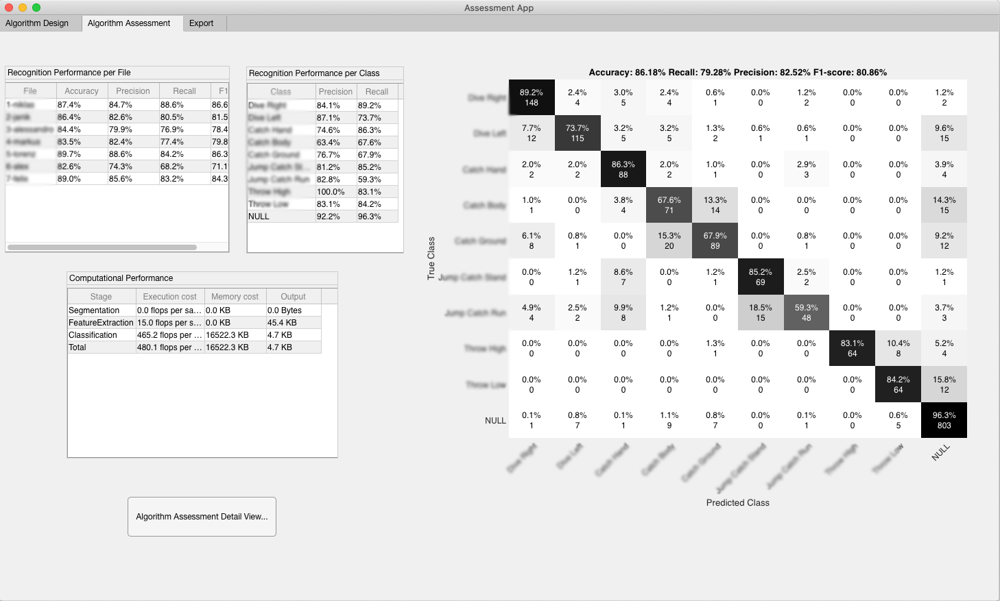
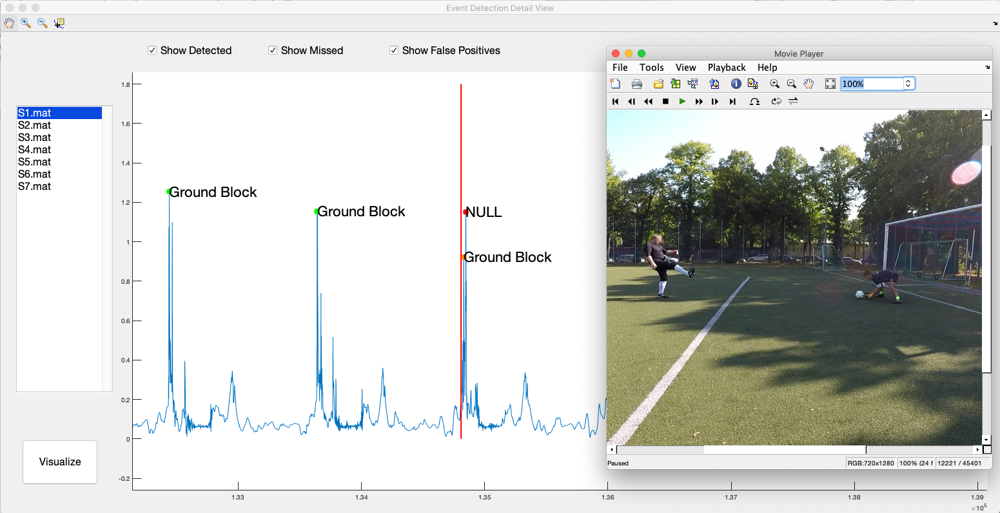

# Wearables Development Toolkit (WDK)

The Wearables Development Toolkit (WDK) is a framework and set of tools to facilitate the iterative development of activity recognition applications with wearable and IoT devices. It supports the annotation of time series data, the analysis and visualization of data to identify patterns and the development and performance assessment of activity recognition algorithms. At the core of the WDK is a repository of high-level components that encapsulate functionality used across activity recognition applications. These components can be used within a Matlab script or within a visual flo-based programming platform (i.e. Node-RED). 


<p align="center">
  
</p>

To get a first insight into the WDK, watch this demo video: [https://www.youtube.com/embed/Ow0b0vkciDs](https://www.youtube.com/embed/Ow0b0vkciDs) and read my [paper](https://www.jhaladjian.com/publications/haladjian19WDK.pdf).

To install and use the WDK, refer to the [Documentation](doc/SETUP.md).

## 1- Data Annotation

An annotated data set is needed to train a machine learning algorithm and to assess its performance. The *Data Annotation App* offers functionality to annotate time series data. Depending on the particular application, one might want to annotate *events* that occurr at a specific moment in time or activities that have a duration in time, called *ranges*. The following image shows the squared magnitude of the accelerometer signal collected by a motion sensor attached at a hind leg of a cow. The individual strides of the cow have been annotated as event annotations (red) and the walking and running activities as ranges (black rectangles).


### Annotating with video (optional)

The *Data Annotation App* can load and display videos next to the data wich is synchronized by specifying at least two data samples and two video frames that correspond to the same event in time. The frames in the video file are displayed by the Movie Player at the bottom right of the window:


In this application, we asked the subject to applaud three times in front of the camera while wearing an armband with an Inertial Measurement Unit (IMU). We matched the samples at the peak of squared magnitude of acceleration to the video frames where the subject's hands make contact with each other.

Please note:

1. The *Data Annotation App* synchronises video and data at two points and interpolates linearly inbetween. I recommend the synchronization points to take place in the beginning and end of a recording.
2. Annotation, marker, synchronization and video files should be consistent with the data files. If a data file is named 'S1.mat', its annotation file should be named '*S1-annotations.txt*', its synchronization file '*S1-synchronization.txt*' and the video '*S1-video.<extension>*'.
3. By default, the *Data Annotation App* loads annotation files from the '*./data/annotations/*', video and synchronization files from '*./data/videos*' directory. Saved annotation files are located in the root '*./*' directory.
4. The labels to annotate should be defined in the '*labels.txt*' file beforehand.
5. You can use the keyboard shortcuts **arrow-right**, **arrow-left** and **spacebar** to iterate through data and video.

## 2- Data Analysis
The *Data Analysis App* displays segments of data grouped by class. This is useful to study the differences across classes to design a recognition algorithm able to discriminate between classes. Segments can be plotted either on top of each other or sequentially (i.e. after each other). 


In order to visualize data:

1. Select one or more input data files.
2. Select where the segments should come from. *Manual annotations* creates segments from the range annotations and loads event annotations to create segments using the *ManualSegmentationStrategy*. The *Automatic segmentation* uses a preprocessing, event detection and segmentation algorithms selected over the user interface to create segments.
3. (in Automatic segmentation mode) Select the signals to use, a preprocessing algorithm and (optionally) an event detection algorithm.
4. Select a segmentation strategy and (optionally) a grouping strategy. Click the *Execute* button. At this point the segments are created. A grouping strategy maps annotated labels to classes, usually by grouping different labels into classes.
5. Select signals and classes to visualize and a plot style (i.e. overlapping or sequential). 

## 3- Algorithm Implementation

Most wearable device applications execute a sequence of computations to recognize specific patterns based on sensor signals. This sequence of computations is called the Activity Recognition Chain and consists of the following *stages*:
 

### Programming

Activity recognition applications can be developed directly in Matlab using the WDK's framework of reusable components. 

The following text snippet creates a chain of computations and saves it to the *goalkeeperChain.mat* file. This chain of computations detects events using a peak detector on the squared magnitude of the accelerometer signal, segments the data around the detected events (200 samples to the left of the event and 30 sampels to the right) and extracts the features defined in the *goalkeeperFeatureChain.mat* file.

```matlab
%select first three axes of acceleration
axisSelector = AxisSelector(1:3);%AX AY AZ

%compute the magnitude of acceleration
magnitudeSquared = MagnitudeSquared();

%detect peaks on the magnitude of acceleration
simplePeakDetector = SimplePeakDetector();
simplePeakDetector.minPeakHeight = single(0.8);
simplePeakDetector.minPeakDistance  = int32(100);

%create segments around detected peaks
eventSegmentation = EventSegmentation();
eventSegmentation.segmentSizeLeft = 200;
eventSegmentation.segmentSizeRight = 30;

%label created segments
labeler = EventSegmentsLabeler();

%load feature extraction algorithm
featureExtractor = DataLoader.LoadComputer('goalkeeperFeatureChain.mat');

%create the recognition algorithm
arcChain = Computer.ComputerWithSequence({FileLoader(),PropertyGetter('data'),...
axisSelector,magnitudeSquared,simplePeakDetector,eventSegmentation,labeler,...
featureExtractor});

%export the recognition algorithm
DataLoader.SaveComputer(arcChain,'goalkeeperChain.mat');
```
This chain of computations produces a feature table that can be used within the *Assessment App* to study the performance of different machine learning algorithms.

### Visual Programming (optional)

Activity recognition applications can also be developed visually in Node-RED using the nodes available in the [WDK-RED platform](https://github.com/avenix/WDK-RED). The following image shows an activity recognition chain for detecting and classifying soccer goalkeeper training exercises using a wearable motion sensor attached to a glove worn by a goalkeeper:


Activity Recognition Chains can be imported and executed in the WDK as follows:

- Create and export the Activity Recognition Chains as described [in the WDK-RED repository](https://github.com/avenix/WDK-RED#exporting).
- Execute the *convertJSONToWDK.m* script.
- Use the *Execute from File* button in each App of the WDK.

## 4- Algorithm Assessment

The development and assessement / evaluation of an activity recognition algorithm usually represents a large fraction of the effort to develop the entire application. The *Assessment App* enables developers to design algorithms by selecting reusable components at each stage of the activity recognition chain and to assess their performance. The recognition performance metrics provided by this tool are:

- Accuracy
- Precision
- Recall
- Confusion Matrix

and the computational performance metrics are:

- Flops: number of floating point operations performed by the algorithm for the input data set
- Memory: amount of memory consumed by the algorithm (in bytes) for the input data set
- Communication: amount of bytes generated by the last component in the recognition chain 

The following image shows the configuration and classification results of an algorithm to detect and classify exercises performed by patients after a hip replacement surgery.



The *Performance Asessment Detail View* displays the classification results on top of the data and next to the corresponding video. Green overlays indicate correctly classified segments and red overlays indicate misclassified segments.



*Note: Feature tables generated with a particular activity recognition algorithm can be exported to *.txt* formats to study the classification on other platforms such as Python / tensorFlow and WEKA.*


## Reusable Components

Here you can find a list of the reusable components, their configurable properties and their performance metrics relative to an input of size *n*.

### Preprocessing

| Name             | Description                                                                                                                                                                                                                                                                                                                    | Flops     | Memory |
|------------------|--------------------------------------------------------------------------------------------------------------------------------------------------------------------------------------------------------------------------------------------------------------------------------------------------------------------------------|-----------|--------|
| HighPassFilter   | Butterworth High-pass filter with order *k*                                                                                                                                                                                                                                                                                    | 13 *k* n  | 1 / n  |
| LowPassFilter    | Butterworth Low-pass filter with order *k*                                                                                                                                                                                                                                                                                     | 31 *k* n  | 1 / n  |
| Magnitude        |                                                                                                                                                                                        | 4 n       | 1 / n  |
| SquaredMagnitude |                                                                                                                                                                                                        | 2 n       | 1 / n  |
| Norm             |                                                                                                                                     | 2 n       | 1 / n  |
| Derivative       | First derivative: . Second derivative:  | 40 n      | 1 / n  |
| S1               |                                                                                                          | 40 *k* n  | n      |
| S2               |                                                                  | 203 *k* n | n      |

Invocations to preprocessing algorithms produce *n* values. The memory consumption of most preprocessing algorithms is *1* if the *inPlaceComputation* property is set to *true* or *n* otherwise.

### Event Detection

| Name               | Description                                                                                                                                                                                      | Flops  | Memory |
|--------------------|--------------------------------------------------------------------------------------------------------------------------------------------------------------------------------------------------|--------|-----|
| SimplePeakDetector | Threshold-based peak detector. Properties are: *minPeakheight* and *minPeakDistance*. *Note: this algorithm is more suitable for deployment into an embedded device than the MatlabPeakDetector* | 11 n   | 1   |
| MatlabPeakDetector | Matlab's peak detector. Properties are: *minPeakheight* and *minPeakDistance*.                                                                                                                   | 1787 n | n   |

*Note: The flops metrics shown above have been calculated with random values in the range [0 1] using minPeakHeight = 0.8, minPeakDist = 100. The performance metrics will vary depending on how often peaks are detected based on the input data and minPeakHeight and minPeakDist properties.*

The event detection algorithms output a single value.

An invocation to an event detection algorithm produces 0 or 1 value.

### Segmentation

| Name               | Description                                                                                                                                                                                                                                            | Flops                                  | Memory                                 |
|--------------------|--------------------------------------------------------------------------------------------------------------------------------------------------------------------------------------------------------------------------------------------------------|----------------------------------------|----------------------------------------|
| SlidingWindow      | Creates a segment of size *segmentSize* after every *sampleInterval* samples. E.g. *segmentSize* = 200 and *sampleInterval* = 100 creates segments with a 50% overlapping. *Note: receives a signal as input.*                                         | *segmentSize*                          | *segmentSize*                          |
| EventSegmentation  | Creates a segment around an event by taking *segmentSizeLeft* samples to the left and *segmentSizeRight* to the right of the event. *Note: receives an event as input.*                                                                                | *segmentSizeLeft* + *segmentSizeRight* | *segmentSizeLeft* + *segmentSizeRight* |
| ManualSegmentation | Creates segments for each annotation (converts RangeAnnotations to segments and creates segments around each EventAnnotations). This segmentation strategy cannot be used in a real application, but is useful to study the quality of the annotations | -                                      | -                                      |

An invocation to a segmentation algorithm produces a segment (of *segmentSize* or *segmentSizeLeft* + *segmentSizeRight* values).

### Labeling

| Name                 | Description                                                                                                                                                                                                                                                       |
|----------------------|-------------------------------------------------------------------------------------------------------------------------------------------------------------------------------------------------------------------------------------------------------------------|
| EventsLabeler        | Labels events as the closest event annotation under a specified *tolerance*                                                                                                                                                                                       |
| EventSegmentsLabeler | Labels segments generated from an event using the *EventsLabeler*                                                                                                                                                                                                 |
| RangeSegmentsLabeler | Labels segments based on range annotations. If the *shouldContainEntireSegment* is set to *true*, segments are labeled if they are fully contained in an annotation. Otherwise, segments are labeled if their middle point is contained within a range annotation |
| LabelMapper          | Maps labels to groups                                                                                                                                                                                                                                             |

### Feature Extraction

#### Time-domain features

| Name         | Description                                                                                                                                                                                                                                                                                                                          | Flops       | Memory             |
|--------------|--------------------------------------------------------------------------------------------------------------------------------------------------------------------------------------------------------------------------------------------------------------------------------------------------------------------------------------|-------------|--------------------|
| Min          | Minimum value in the input signal.                                                                                                                                                                                                                                                                                                   | n           | 1                  |
| Max          | Maximum value in the signal.                                                                                                                                                                                                                                                                                                         | n           | 1                  |
| Mean         | Average of every value in the input signal.                                                                                                                                                                                                                                                                                          | n           | 1                  |
| Median       | Median of the input signal.                                                                                                                                                                                                                                                                                                          | 15 n        | 1                  |
| Variance     | Variance of the input signal.                                                                                                                                                                                                                                                                                                        | 2 n         | 1                  |
| STD          | Standard Deviation of the input signal.                                                                                                                                                                                                                                                                                              | 2 n         | 1                  |
| ZCR          | Zero Crossing Rate. Amount of times the signal crosses the zero line.                                                                                                                                                                                                                                                                | 5 n         | 1                  |
| Skewness     | A measure of the asymmetry in the distribution of values in the input signal calculated as:                                                                     | 6 n         | 1                  |
| Kurtosis     | Describes the "tailedness" of the distribution of values in the input signal.                                                                                   | 6 n         | 1                  |
| IQR          | Computes the difference between Q3 and Q1 where Q1 is the median of the n/2 smallest values and Q3 is the median of the n/2 largest values in an input signal of size n. Can be calculated in O(n) time.                                                                                                                             | 57 n        | n                  |
| AUC          | Area under the curve computed with the trapezoid rule:                                                                                                                                              | 8 n         | 1                  |
| AAV          | Average Absolute Variation:                                                                                                                                                  | 5 n         | 1                  |
| Correlation  |  Pearson correlation coefficient of two n-dimensional inputs                                                                                                                                                                                                                                                                         | 3 n         | n                  |
| Energy       | sum of squared values in the input signal:                                                                                                                                                                                                    | 2 n         | 1                  |
| Entropy      | Estimates the amount of information in the input signal. Rare events (i.e. sample values) carry more information (and have a higher entropy) than seldom events.  where pi are the probability distribution values of the input signal | n^2         | n                  |
| MAD          | Mean Absolute Deviation. The average distance of each data point to the mean.                                                                                                | 5 n         | 1                  |
| MaxCrossCorr | Maximum value of the cross correlation coefficients of two input signals. *Note: input should be a nx2 array*.                                                                                                                                                                                                                       | 161 n       | n                  |
| Octants      | Determines the octant of each sample in an input array of n samples with 3 columns each (e.g. if all three columns are positive, octant = 1. If all 3 columns are negative, octant = 7).                                                                                                                                             | 7 n         | 1                  |
| P2P          | Peak to Peak distance (distance between maximum and minimum values).                                                                                                                                                                                                                                                                 | 3 n         | 1                  |
| Quantile     | Computes the *numQuantileParts* cutpoints that separate the distribution of samples in the input signal.                                                                                                                                                                                                                             | 3 n log2(n) | *numQuantileParts* |
| RMS          | Root Mean Squared.                                                                                                                                                                                                     | 2 n         | 1                  |
| SMV          |                                                                                                                                                                                | 4 n         | 1                  |
| SMA          | Sum of absolute values of every sample (takes 2-D inputs)                                                                                                                   | n m         | 1                  |

Invocations to time-domain feature extraction algorithms produce a single value except for the Quantile component which produces *numQuantileParts* values.

#### Frequency-domain features

| Name             | Description                                                                                                                                                                                                                                                                                                              | Flops     | Memory |
|------------------|--------------------------------------------------------------------------------------------------------------------------------------------------------------------------------------------------------------------------------------------------------------------------------------------------------------------------|-----------|--------|
| FFT              | FFT of the input signal                                                                                                                                                                                                                                                                                                  | n log2(n) | n      |
| FFTDC            | DC component of the FFT of the input signal                                                                                                                                                                                                                                                                              | 1         | 1      |
| MaxFrequency     | Maximum value in the fourier transform of the input signal                                                                                                                                                                                                                                                               | n         | 1      |
| PowerSpectrum    | Distribution of power into frequency components. *Note: outputs n coefficients*                                                                                                                                                                                                                                          | 4 n       | n      |
| SpectralCentroid | Indicates where the "center of mass" of the spectrum is located.                                                                            | 10 n      | 1      |
| SpectralEnergy   | The energy of the frequency domain (sum of squared values of dft coefficients).                                                                                                                                | 2 n       | 1      |
| SpectralEntropy  | Indicates how chaotic / how much informatiomn there is in the frequency distribution. Calculated as:  where yi are the coefficients of the power spectrum of the input signal                                    | 21 n      | 1      |
| SpectralFlatness | Provides a way to quantify how noise-like a sound is. White noise has peaks in all frequencies making its spectrum look flat.  | 68 n      | 1      |
| SpectralSpread   | Indicates the variance in the distribution of frequencies.                                                                                                                                                                                                                                                               | 11 n      | 1      |

Invocations to frequency-domain feature extraction algorithms output a single value except for the FFT and PowerSpectrum which produce *n/2* and *n* values respectively.

### Classification

| Name               | Description                                                                |
|--------------------|----------------------------------------------------------------------------|
| LDClassifier       | Linear Discriminant classifier                                             |
| TreeClassifier     | Properties: *maxNumSplits*                                                 |
| KNNClassifier      | K Nearest Neighbors classifier. Properties: *nNeighbors*, *distanceMetric* |
| EnsembleClassifier | Properties: *nLearners*                                                    |
| SVMClassifier      | Support Vector Machine. Properties: *order*, *boxConstraint*               |

The performance metrics of each classifier depend on its configuration and are calculated at runtime.

### Postprocessing
| Name                          | Description                                                                                                                                                                                                                                               |
|-------------------------------|-----------------------------------------------------------------------------------------------------------------------------------------------------------------------------------------------------------------------------------------------------------|
| LabelMapper                   | maps classified labels to different labels. Can be used to group classified labels when a greater level of detail was used in the classification.                                                                                                         |
| LabelSlidingWindowMaxSelector | replaces every label at index labelIndex in an array of predicted labels with the most frequent label in the range [labelIndex −windowSize/2,labelIndex +windowSize/2, or with the NULL-class if no label occurs at least minimumCount times in the range |

The postprocessing components produce a label as output.

### Utilities

| Name               | Description                                                                                                                                                                                                                                  | Flop | Memory                    | Communication             |
|--------------------|----------------------------------------------------------------------------------------------------------------------------------------------------------------------------------------------------------------------------------------------|------|---------------------------|---------------------------|
| FeatureExtractor   | Generates a table from an array of segments using the feature extraction method set in the *computers* property                                                                                                                              | -    | -                         | -                         |
| FeatureNormalizer  | Normalizes a features table by subtracting the *means* property and dividing by the *stds* property. If the *shouldComputeNormalizationValues* poperty is set to *true*, it computes the *means* and *stds * properties from the input table | -    | -                         | -                         |
| FeatureSelector    | Returns a table with the columns in *selectedFeatureIdxs* property. The *findBestFeaturesForTable(f)* method can be used to identify the *f* most relevant features. The mRMR feature selection algorithm is used for this purpose           | -    | -                         | -                         |
| ConstantMultiplier | Multiplies an input by the *constant* property                                                                                                                                                                                               | n    | n                         | n                         |
| Substraction       | Subtracts the second column from the first column of the input signal                                                                                                                                                                        | 2 n  | n                         | n                         |
| AxisMerger         | Merges *m* signals of size *n* into an *n*x*m* matrix. Outputs the merged signal as soon as *m* signals have been received. The *nAxes* property indicates how many signals are expected                                                     | 3 n  | m n                       | m n                       |
| AxisSelector       | Selects the *axes* columns of the provided input matrix. Returns a new matrix                                                                                                                                                                | -    | m n                       | m n                       |
| Merger             | Merges *m* objects into a cell array. Generates an output as soon as *m* objects have been received                                                                                                                                          | 1    | 1                         | 1                         |
| NoOp               | Outputs the input object without modification. Can be useful when connected to several nodes to start an execution graph with multiple entry points                                                                                          | 1    | 1                         | *                         |
| PropertyGetter     | Outputs the value of the *property* property of the input object                                                                                                                                                                             | 1    | *                         | *                         |
| PropertySetter     | Sets the *property* property of the *node* object to the input value. Outputs an empty object                                                                                                                                                | 1    | 1                         | -                         |
| RangeSelector      | Outputs a signal with the values in the range [*rangeStart* - *rangeEnd*] of the input signal                                                                                                                                                | 2 n  | *rangeEnd* - *rangeStart* | *rangeEnd* - *rangeStart* |
| SegmentsGrouper    | Receives an array of segments and outputs the segments grouped by their class in a cell array. Each cell at index *i* contains an array of the segments of class *i* in the input                                                            | -    | -                         | -                         |
| TableRowSelector   | Selects the rows with *selectedLabels* labels in the input Table. Returns the filtered input Table                                                                                                                                           | -    | -                         | -                         |                                                                                                                                        | -    | -                         |

The amount of memory and output size of the *PropertyGetter* and *NoOp* modules depend on their input and configuraton values and are computed at runtime.


## References

- My paper describing the Wearables Development Toolkit [WDK paper](https://www.jhaladjian.com/publications/haladjian19WDK.pdf) and [BibTeX file](https://www.jhaladjian.com/publications/haladjian19WDK.bib)
- My Matlab tutorial on Activity Recognition for wearables: https://github.com/avenix/ARC-Tutorial/
- [Andreas Bulling's tutorial on Activity Recognition](https://dl.acm.org/citation.cfm?id=2499621)
- [Peak detection algorithms by Palshikar](http://constans.pbworks.com/w/file/fetch/120908295/Simple_Algorithms_for_Peak_Detection_in_Time-Serie.pdf)
- [mRMR feature selection by Peng](http://home.penglab.com/proj/mRMR/)
- [Nick Gillian's Gesture Recognition Toolki](https://github.com/nickgillian/grt)

Applications developed with the WDK:

1. https://www.mdpi.com/2414-4088/2/2/27
2. https://dl.acm.org/citation.cfm?id=3267267

## About
My name is Juan Haladjian. I developed the Wearables Development Toolkit as part of my post-doc at the Technical University of Munich. Feel free to contact me with questions or feature requests. The project is under an MIT license. You are welcome to use the WDK, extend it and redistribute it for any purpose, as long as you give credit for it by copying the *LICENSE.txt* file to any copy you make.

Feel free to contact me with feedback or feature requests.

Website: [www.jhaladjian.com](https://www.jhaladjian.com)

Academic Website: [http://in.tum.de/~haladjia](http://home.in.tum.de/~haladjia/)

LinkedIn: [www.linkedin.com/in/juan-haladjian](https://www.linkedin.com/in/juan-haladjian)

Email: [haladjia@in.tum.de](mailto:haladjia@in.tum.de)

## Cite this project

```bash
@misc{haladjian2019,
  author =       {Juan Haladjian},
  title =        {{The Wearables Development Toolkit (WDK)}},
  howpublished = {\url{https://github.com/avenix/WDK}},
  year =         {2019}
}
```
