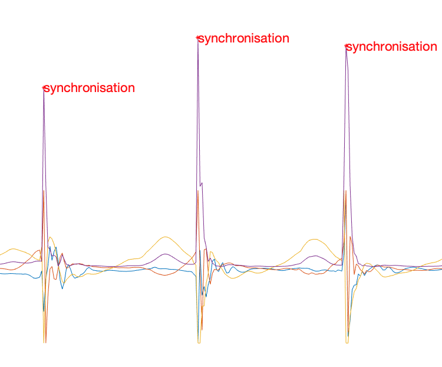

# Wearables Development Toolkit (WDK)

The Wearables Development Toolkit (WDK) is a set of tools to facilitate the development of wearable device / activity recognition applications. The usual activities involved in the development of such applications are: data collection, data annotation, algorithm development, algorithm evaluation and deployment (i.e. integration of the code into the wearable device): 


## Setup

* install Matlab 2018b or greater. 
* `git clone git@github.com:avenix/ARC-Tutorial.git`
* in Matlab, `addpath(genpath('./'))`
* use the Apps in each directory (e.g. *Data Annotation App* in *1-DataAnnotation/*).
* this code uses the mRMR library for feature selection. If you get an error 'estpab function not found', then you need to:
```
cd libraries/mRMR_0.9/mi/
mex -setup C++ 
makeosmex
```

The WDK requires the installation of the Signal Processing Toolbox:


*Note: to avoid issues with pathing, Matlab's current path should be set to the root of the WDK directory:* 


### Data Structure

The '*/data*' directory should contain the following files and directories defined in the *Constants.m* file:

```
classesPath = './data/classes.txt';
annotationsPath = './data/annotations';
markersPath = './data/markers';
dataPath = './data/rawdata';
precomputedPath = './data/cache';
labelingStrategiesPath = './data/labeling';
kVideosPath = './data/videos';
```
## Data Collection

The *Data Loader App* can be used to do a first check on the data after its collection. It offers the following features:
- Load any tabularized ".txt" data file and save it to Matlab's binary format, which is used by the rest of the toolkit.
- Check whether there has been data loss. For this purpose, a timestamp / counter signal and an sampling interval should be provided.
- Visualize the different signals.


*Note: by default, the DataLoaderApp loads data files from the ./data/rawdata/ directory. Files are saved to the ./ root directory.*

## Data Annotation

An annotated data set is needed to train a machine learning algorithm and to assess its performance. The *Data Annotation App* offers functionality to annotate time series data. Depending on the particular application, one might want to annotate specific events or activities that have a duration in time. The *Data Annotation App* supports both kinds of annotations.


### Synchronising a Video (optional)

The *Data Annotation App* can load and display videos next to the data. The video is synchronised to the data by matching two data samples to two video frames as defined in a synchronisation file. The format of a synchronisation file is:

```
sample1: 49727
sample2: 450209
frame1: 3302
frame2: 45284
```

The exact frames of a specific event in a video can be found by iterating the video frame by frame. The current video frame is shown at the bottom right of the window:


In this application, we asked the subject to applaud three times in front of the camera while wearing an armband with an Inertial Measurement Unit (IMU). We visualized the peak energy (i.e. squared magnitude) of the accelerometer signal and annotated each applause with the *synchronisation* label. When a data samples is selected on the plot, its timestamp is printed on Matlab's console. We copy the first synchronisation timestamp to the sample1 field of the synchronisation file. We do the same for the sample with timestamp *450209*. The respective annotated synchronisation events are shown in the following image:



*Note: the AnnotationApp synchronises video and data at two points and interpolates linearly inbetween. We recommend the synchronisation points to take place in the beginning and end of of a recording session.*

*Tipp: use the keyboard shortcuts arrow-right, arrow-left and spacebar to iterate through the data and video.*

To consider:

1. Annotation, marker, synchronisation and video files should be consistent with the data files. If a data file is named 'S1.mat', its annotation file should be named 'S1-annotations.txt', its marker file 'S1-markers.edl', its synchronisation file 'S1-synchronisation.txt' and the video 'S1-video.<extension>'.
2. By default, the *Data Annotation App* loads annotation files from the './data/annotations/', video and synchronisation files from './data/videos' directory. Saved annotation files are located in the root './' directory.
3. The classes to annotate should be defined in the 'classes.txt' file beforehand.

### Importing External Markers (optional)
The *Data Annotation App* can import and display reference markers on top of the time series data. Currently, the *Data Annotation App* supports marker files created with the video annotation tool [DaVinciResolve](https://www.blackmagicdesign.com/products/davinciresolve/) in *.edl* format. Markers added to a timeline in DaVinciResolve can be exported by: right-clicking on the *Timeline -> timelines -> export -> Timeline markers to .EDL...*:


Before the markers can be displayed properly on top of the time series data, they need to be synchronised to the time series data. In order to do this, the *.edl* file should contain a synchronisation marker in the beginning and another one in the end of the file. Currently, the first and last green marker are matched to the first and last event annotation of the class *synchronisaton*. In order to annotate data:

1. Annotate the video using DaVinci Resolve. Use a green marker to annotate a special event, ideally in the beginning and end of the file. (e.g. the user shakes the sensor three times in front of the camera).
2. Export the markers to an *.edl* file.
3. Copy the *.edl* file to the *data/markers/* directory.
4. Open the *Data Annotation App* and add an event annotation of the class *synchronisation* to the timestamp that corresponds .
5. Reopen the *Data Annotation App*. This time the markers should be properly aligned with the data.
6. Annotate the time series data.

*Note: markers in .edl format are read from the './data/markers' directory*.

## Data Visualization
The *Data Visualization App* displays segments of data grouped by class. This is useful to study the differences across classes (e.g. to design an event detection or feature extraction algorithm). Segments can be plotted either on top of each other or sequentially (i.e. after each other). In order to visualize data:

1. Select one or more input data files.
2. Select where the segments should come from. *Manual annotations* creates segments from the range annotations and loads event annotations to create segments using the *ManualSegmentationStrategy*. The *Automatic segmentation* uses a preprocessing, event detection and segmentation algorithms selected over the user interface to create segments.
3. (in Automatic segmentation mode) Select the signals to use, a preprocessing algorithm and (optionally) an event detection algorithm.
4. Select a segmentation strategy and (optionally) a grouping strategy. Click the *Create* button. At this point the segments are created.
6. Select signals and classes to visualize and a plot style. 


## Event Detection
Some wearable applications need to detect the occurrence of specific events in a stream of sensor values. The challenge is to detect the relevant events (also called target-class or true positives) while ignoring irrelevant events (also called non-target class or false positives). 

The *Event Detection App* can be used to compare the performance of different event detection algorithms. This includes the amount of relevant and irrelevant events detected for each file / subject and the amount of events detected of each class. The *Event Detection App* enables developers to gain insight into the performance of a particular event detection algorithm. For this purpose, a developer might zoom into the data and observe the detected and missed events together with the data. 


## Application Development

Most wearable device applications execute a chain (i.e. sequence) of computations in order to detect specific patterns based on sensor signals. This chain of computations is called the Activity Recognition Chain:


We use the term *stage* to refer to the different parts in the activity recognition chain (e.g. Preprocessing stage, Segmentation stage). The WDK provides the following reusable components for every stage of the chain:

### Preprocessing

| Name             | Desscription                                                                                                                                                                                                                                                                | Flops     | Mem | Comm |
|------------------|-----------------------------------------------------------------------------------------------------------------------------------------------------------------------------------------------------------------------------------------------------------------------------|-----------|-----|------|
| HighPassFilter   | Butterworth High-pass filter                                                                                                                                                                                                                                                | order * n | n   | n    |
| LowPassFilter    | Butterworth High-pass filter                                                                                                                                                                                                                                                | order * n | n   | n    |
| Magnitude        |                                                                                                               | 5 * n     | n   | n    |
| SquaredMagnitude |                                                                                                                                  | 5 * n     | n   | n    |
| Norm             |                                                               | 5 * n     | n   | n    |
| S1               |                                          | n * k     | n   | n    |
| S2               |  | n * k     | n   | n    |

### Event Detection

| Name               | Desscription                                                                                                                                                                                 | Flops  | Mem | Comm |
|--------------------|----------------------------------------------------------------------------------------------------------------------------------------------------------------------------------------------|--------|-----|------|
| SimplePeakDetector | Threshold-based peak detector. Properties are: *minPeakheight* and *minPeakDistance*. *Note: this algorithm is more suitable for deployment into an embedded device than Matlab's peak detector* | 4 * n  | 1   | 1    |
| MatlabPeakDetector | MatlabPeakDetector. Properties are: *minPeakheight* and *minPeakDistance*.                                                                                                                   | 10 * n | n   | 1    |

### Segmentation

| Name              | Desscription                                                                                                                                                               | Flops | Mem | Comm                                   |
|-------------------|----------------------------------------------------------------------------------------------------------------------------------------------------------------------------|-------|-----|----------------------------------------|
| OverlappingWindow | Creates a segment of size *segmentSize* after every *sampleInterval* samples. E.g. *segmentSize* = 200 and *sampleInterval* = 100 creates segments with a 50% overlapping. *Note: receives a signal as input.* | 4 * n | 1   | *segmentSize*                          |
| EventSegmentation | Creates a segment around an event by taking *segmentSizeLeft* samples to the left and *segmentSizeRight* to the right of the event. *Note: receives an event as input.*                                        | 4 * n | 1   | *segmentSizeLeft* + *segmentSizeRight* |


### Feature Extraction

#### Time-domain features

| Name                  | Description                                                                                                                                                                                                                                                       | Flops      | Mem                | Comm               |
|-----------------------|-------------------------------------------------------------------------------------------------------------------------------------------------------------------------------------------------------------------------------------------------------------------|------------|--------------------|--------------------|
| AAV                   | Average Absolute Variation:                                                                               | 5 * n      | 1                  | 1                  |
| AUC                   | Area under the curve computed with the trapezoid rule:                                                                           | 6 * n      | 3                  | 1                  |
| Entropy               | Estimates the amount of information in the input signal. Rare events (i.e. sample values) carry more information (and have a higher entropy) than seldom events.                | n * n      | n                  | 1                  |
| IQR                   | Computes the difference between Q3 and Q1 where Q1 is the median of the n/2 smallest values and Q3 is the median of the n/2 largest values in an input signal of size n.                                                                                          | n * log(n) | n                  | 1                  |
| Kurtosis              | Describes the "tailedness" of the distribution of values in the input signal.                | 7 * n      | 1                  | 1                  |
| MAD                   | Mean Absolute Deviation. The average distance of each data point to the mean.                             | 5 * n      | 1                  | 1                  |
| Max                   | Maximum value in the signal.                                                                                                                                                                                                                                      | 2 * n      | 1                  | 1                  |
| MaxCrossCorr          | Maximum value of the cross correlation coefficients of two input signals. *Note: input should be a nx2 array*.                                                                                                                                                    | n * log(n) | n                  | 1                  |
| Mean                  | Average of every value in the input signal.                                                                                                                                                                                                                       | 3 * n      | 2                  | 1                  |
| Median                | Median of the input signal.                                                                                                                                                                                                                                       | 6 * n      | 4                  | 1                  |
| Min                   | Minimum value in the input signal.                                                                                                                                                                                                                                | 2 * n      | 1                  | 1                  |
| Octants               | Determines the octant of each sample in an input array of n samples with 3 columns each (e.g. if all three columns are positive, octant = 1. If all 3 columns are negative, octant = 7).                                                                          | 4 * n      | 1                  | 1                  |
| P2P                   | Peak to Peak distance (distance between maximum and minimum values).                                                                                                                                                                                              | 4 * n      | 3                  | 1                  |
| Quantile              | Computes *numQuantileParts* cutpoints that separate the distribution of samples in in the input signal.                                                                                                                                                           | n * log(n) | *numQuantileParts* | *numQuantileParts* |
| RMS                   | Root Mean Squared.                                                                                                                                  | 8 * n      | 3                  | 1                  |
| SignalVectorMagnitude |                                                                                                             | 7 * n      | 1                  | 1                  |
| Skewness              | A measure of the asymmetry in the distribution of values in the input signal calculated as:  | 10 * n     | 5                  | 1                  |
| SMA                   | Sum of absolute values on each input signal.                                                                                                                                                                                                                      | 3 * n * n  | 1                  | 1                  |
| SquaredMagnitudeSum   | Sum of squared values of input signal.                                                                                                                                                                                                                            | 3 * n      | 1                  | 1                  |
| STD                   | Standard Deviation of the input signal.                                                                                                                                                                                                                           | 6 * n      | 2                  | 1                  |
| Variance              | Variance of the input signal.                                                                                                                                                                                                                                     | 6 * n      | 2                  | 1                  |
| ZCR                   | Zero Crossing Rate. Amount of times the signal crosses the zero line.                                                                                                                                                                                             | 7 * n      | 1                  | 1                  |

#### Frequency-domain features

| Name             | Description                                                                                                                                                                                                                                                                                                              | Flops           | Mem | Comm |
|------------------|--------------------------------------------------------------------------------------------------------------------------------------------------------------------------------------------------------------------------------------------------------------------------------------------------------------------------|-----------------|-----|------|
| FFTDC            | Computes the DC component of the FFT of the input signal                                                                                                                                                                                                                                                                 | 8 * n * log(n)  | n   | 1    |
| MaxFrequency     | Computes the maximum value in the fourier transform of the input signal                                                                                                                                                                                                                                                  | 10 * n * log(n) | n   | 1    |
| PowerSpectrum    | Distribution of power into frequency components. *Note: returns n/2 coefficients*                                                                                                                                                                                                                                        | 10 * n * log(n) | n   | n/2    |
| SpectralCentroid | Indicates where the "center of mass" of the spectrum is located.                                                                            | 10 * n * log(n) | n   | 1    |
| SpectralEnergy   | The energy of the frequency domain (sum of squared values of dft coefficients).                                                                                                                                | 10 * n * log(n) | n   | 1    |
| SpectralEntropy  | Indicates how chaotic / how much informatiomn there is in the frequency distribution. Calculated as:  where y_i are the coefficients of the power spectrum of the input signal                              | 15 * n * log(n) | n   | 1    |
| SpectralFlatness | Provides a way to quantify how noise-like a sound is. White noise has peaks in all frequencies making its spectrum look flat.  | 15 * n * log(n) | n   | 1    |
| SpectralSpread   | Indicates the variance in the distribution of frequencies.                                                                                                                                                                                                                                                               | 15 * n * log(n) | n   | 1    |
 
 ## Evaluation
 
 The iterative development and evaluation of an activity recognition algorithm usually takes a large fraction of the development effort. The *Data Evaluation App* enables developers to design an algorithm by selecting reusable components at every stage of the activity recognition chain (e.g. preprocessing, segmentation) and assess its performance. The calculated performance metrics are:
 
 Recognition Performance:
 - Accuracy
 - Precision
 - Recall
 - Confusion Matrix
 
 Computational Performance:
 - Flops: Number of floating point operations performed by the algorithm for the input data set
 - Memory: Amount of memory consumed by the algorithm (in bytes) for the input data set
 - Communication: Amount of bytes output by the last component in the recognition chain (requires the user to map the computation components to hardware devices) 
 
 
 
 The generated feature tables can be exported in both *.mat* and *.txt* formats. The *.txt* format makes it possible to study the classification on other platforms (e.g. python / tensorFlow or WEKA). 

 ## Getting started
1. Place your data files (.txt or .mat) in the *./data/rawdata/* directory
2. If your files are in *ASCII*  format, you might want to convert them to a binary format with the *DataLoaderApp*. Files in binary format will load faster.
3. Define your classes in the *classes.txt* file. 
4. Open the *Data Annotation App* to annotate your data. Annotations created with the App need to be saved into the *./data/annotations* directory.
5. You might want to annotate the data at a greater level of detail than your application should recognize. For example, if your application should detect lacrosse goalkeeper training exercises such as *catches*, *throws* and *passes*, you could annotate the catches at a greater level of detail as: *catchLowRight*, *catchLowLeft* but start the data analysis by studying whether any catch can be detected. In this case, you might want to group the catches into a common *catch* class. This can be achieved by creating a labeling strategy. A labeling strategy maps annotations made to groups. Labeling strategies are specified in a *.txt* file as: 
```
#Group1 
class1
class2
class3

#Group2
class4
class5
```
You don't need to assign every class to a group in a labeling strategy. A class left ungrouped will be assigned to its own group automatically. You should ensure that the classes you provide have been defined in the *./data/classes.txt* file and that no class belongs to two groups at the same time. Labeling strategies should be placed in the *./data/labeling/* directory.

*Note: If you will annotate irrelevant classes, the labeling strategy should contain a group called 'NULL'*

6. The WDK offers a Matlab App to support you in each stage of the development your wearable applications. Look for the respective App in each directory.

*Note: The default data paths can be changed in the Constants class*.  
 
 ## Troubleshooting

Most errors after installation will be due to pathing issues. Paths are defined in the Constants.m file. Double-check the different directories exist in your file system.

Furthermore, errors identified by Matlab will be shown over the console:

> 'Error - no labeling strategy available'.

Check the *./data/labeling/* directory. There might be no *.txt* file containing a labeling strategy.

> 'Error. Invalid annotation class'. 

An annotation file in *./data/annotations/* contains an invalid label (i.e. a class which is not listed in the *./data/classes.txt* file)  

> 'Error. class not defined'
 
 The *ClassesMap* triggers this error when it is requested to map a string of an invalid class. This error might be due to a file in the  *./data/labeling/* directory containing an invalid class name.
 
 > 'Warning - FeatureSelector - every segment has same value. Feature selection might fail';
 
 The current version of the *FeatureSelector* uses the mRMR algorithm to select the most relevant features. The mRMR algorithm will fail if every feature vector contains the same value for a particular feature.

If Matlab crashes with an error:
 > 'Too many input arguments'
 
 double-check you are using Matlab 2018b or latest. Previous versions of Matlab might handle cell arrays differently.
 
 > 'Unrecognized property 'Scrollable' for class 'matlab.ui.Figure'
 
 double-check you are using Matlab 2018b or latest. Figures in previous versions of Matlab did not have the Scrollable property. If you still would like to use a previous release of Matlab, uncheck the *Scrollable* property under the *Interactivity* category of the main Figure of the VisualizationApp and EvaluationApp.  
 
The data in the *./data/rawData* directory should be consistent. You will get errors if different files have different amount of columns. 

Double-check that the *./data/annotations/* directory contains an annotation file for each data file in *./data/rawdata/*.  

## References

1. Matlab tutorial on Activity Recognition for wearables: https://github.com/avenix/ARC-Tutorial/
2. Andreas Bulling's tutorial on Activity Recognition: https://dl.acm.org/citation.cfm?id=2499621
2. [Peak detection algorithms by Palshikar](http://constans.pbworks.com/w/file/fetch/120908295/Simple_Algorithms_for_Peak_Detection_in_Time-Serie.pdf)
3. [mRMR feature selection by Peng](http://home.penglab.com/proj/mRMR/)

Applications developed with the WDK:

1. https://www.mdpi.com/2414-4088/2/2/27
2. https://dl.acm.org/citation.cfm?id=3267267

## About
My name is Juan Haladjian. I developed the Wearables Development Toolkit as part of my post-doc at the Technical University of Munich. Feel free to contact me with feature requests:

Email: [haladjia@in.tum.de](mailto:haladjia@in.tum.de)

Website: [http://in.tum.de/~haladjia](http://in.tum.de/~haladjia)
