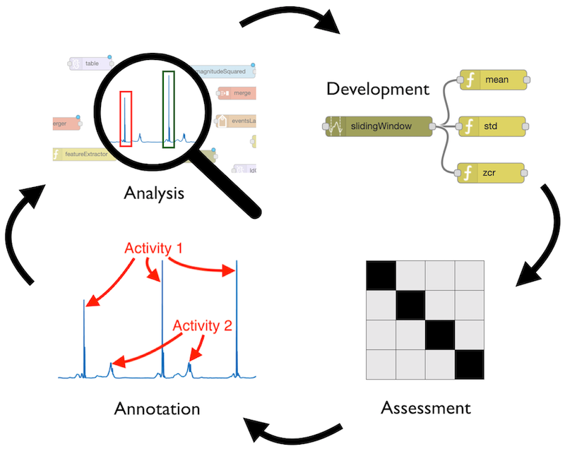

# Wearables Development Toolkit

The Warables Development Toolkit facilitates the development of wearable device applications. The usual activities involved in the development of such applications are: data collection, data annotation, algorithm development, algorithm evaluation and deployment (i.e. integration of the code into the wearable device): 



 This Toolkit offers different tools for each of these activities.

*Note: Check my Matlab tutorial on the Activity Recognition Chain for wearables: <https://github.com/avenix/ARC-Tutorial/>*

## Setup

* install Matlab 2018b or greater. 
* `git clone git@github.com:avenix/ARC-Tutorial.git`
* in Matlab, `addpath(genpath('./'))`
* enjoy the Apps in each directory (e.g. *DataAnnotationApp* in *1-DataAnnotation/*).
* this code uses the mRMR library for feature selection. If you get an error 'estpab function not found', then you need to:
```
cd libraries/mRMR_0.9/mi/
mex -setup C++ 
makeosmex
```

The WDK requires the installation of the Signal Processing Toolbox:


*Note: When running the toolkit for the first time, ensure the Constants.m file points to the right data/ directory.*

*Note: to avoid issues with pathing, always stay at the root directory of the repository. You can check your matlab directory as shown in red in the following image* 


### Data Structure

The *Constants.m* file defines the following path constants:

```
classesPath = './data/classes.txt';
annotationsPath = './data/annotations';
markersPath = './data/markers';
dataPath = './data/rawdata';
precomputedPath = './data/cache';
labelingStrategiesPath = './data/labeling';
```
- Make sure these paths point to the right directory in your filesystem.
- List the classes of your particular application in the *classes.txt* file. These classes are used to annotate the data. You can include relevant and non-relevant classes.

## Data Collection

Once you have data available for analysis, you can use the *DataLoaderApp* in *0-DataLoader* to do a first check on the data and convert it to Matlab's binary format, used by the rest of the toolkit.


*Note: the DataLoader can load any file in comma separated format.*

*Note: by default, the DataLoaderApp will load data files from the ./data/rawdata/ directory*

## Data Annotation

An annotated data set is needed to train a machine learning algorithm and to assess its performance. The *DataAnnotationApp* offers functionality to annotate time series data. Depending on the particular application, you will want to annotate specific events or activities that have a duration in time. The *DataAnnotationApp* supports both kinds of annotations.

It might be cumbersome to annotate time series data without a reference. The *DataAnnotationApp* can import and display markers on top of the time series data. Currently, the *DataAnnotationApp* supports marker files created with the video annotation tool [DaVinciResolve](https://www.blackmagicdesign.com/products/davinciresolve/) in *.edl* format. Markers added to a timeline in DaVinciResolve can be exported by: right-clicking on the Timeline, timelines, export, Timeline markers to .EDL..., as shown in the image below:


Before the markers can be displayed properly on top of the time series data, they need to be synchronised to the time series data. In order to do this, the *.edl* file should contain a marker in green color in the beginning and another one in the end of the file. These markers will be automatically matched to the first and last annotation labeled as *synchronisaton'. This is the typical annotation flow:

1. Annotate the video using DaVinci Resolve. Use a green marker to annotate a special event, ideally in the beginning and end of the file. (e.g. the user shakes the sensor three times in front of the camera).
2. Export the markers to an *.edl* file.
3. Copy the *.edl* file to the *data/markers/* directory.
4. Open the *DataAnnotationApp* and annotate the special events using the *synchronisation* class.
5. Reopen the *DataAnnotationApp*. This time the markers should be properly aligned with the data.
6. Annotate the time series data.


*Note: by default, the DataAnnotationApp will load annotation files from the ./data/annotations/ directory. Saved annotation files will be stored in the root './' directory*.

*Note: markers in .edl format will be read from the ./data/markers directory*.

*Note: in order to be able to annotate a data set, the classes should have previously been defined in the ./data/classes.txt file*

## Data Visualization
The *Data Visualization App* displays the signals corresponding to different classes. After a preprocessing, an event detection algorithm (optional) and segmentation strategy have been chosen, the *Data Visualization App* plots the segments of every selected class. Segments can be plotted either on top of each other or after each other.


## Event Detection
Some wearable applications detect the occurrence of specific events in a stream of sensor values. The challenge is to design an algorithm that detects the relevant events (also called target-class or true positives) while ignoring irrelevant events (also called non-target class or false positives). 

The *Event Detection App* can be used to compare the performance of different event detection algorithms. This includes  the amount of relevant and irrelevant events detected for each file / subject and the amount of events detected of each class. The *Event Detection App* enables developers to gain insight into the performance of a particular event detection algorithm. For this purpose, a developer might zoom into the data and observe the detected and missed events together with the data. 


## Evaluation
Great part of the effort to develop an activity recognition application will be invested in the development of an algorithm (i.e. chain of computations) able to recognize the particular activities accurately and within the computational constraints of the wearable device. This development is usually done iteratively based on a frequent performance evaluation.

The *Data Evaluation App* enables developers to design an algorithm by selecting reusable components at any stage of the activity recognition chain and assess its performance. The calculated performance metrics are:

Recognition Performance:
- Accuracy
- Precision
- Recall
- Confusion Matrix

Computational Performance:
- Number of floating point operations performed by the algorithm
- Amount of memory consumed by the algorithm (in bytes)
- Amount of communication required by the algorithm (requires the user to map the computation components to hardware devices) 


The generated feature tables can be exported in both *.mat* and *.txt* formats. The *.txt* format makes it possible to study the classification on other platforms (e.g. python / TensorFlow or WEKA). 

## Application Development

Most wearable device applications execute a chain (i.e. sequence) of computations in order to detect specific patterns based on sensor signals. This chain of computations is called the Activity Recognition Chain:


We use the term *stage* to refer to the different parts in the activity recognition chain (e.g. Preprocessing stage, Segmentation stage). The WDK provides the following reusable components for every stage of the chain:

### Preprocessing

| Name             | Desscription                                                                                                                                                                                                                                                                | Flops     | Mem | Comm |
|------------------|-----------------------------------------------------------------------------------------------------------------------------------------------------------------------------------------------------------------------------------------------------------------------------|-----------|-----|------|
| HighPassFilter   | Butterworth High-pass filter                                                                                                                                                                                                                                                | order * n | n   | n    |
| LowPassFilter    | Butterworth High-pass filter                                                                                                                                                                                                                                                | order * n | n   | n    |
| Magnitude        |                                                                                                               | 5 * n     | n   | n    |
| SquaredMagnitude |                                                                                                                                  | 5 * n     | n   | n    |
| Norm             |                                                               | 5 * n     | n   | n    |
| S1               |                                          | n * k     | n   | n    |
| S2               |  | n * k     | n   | n    |

### Event Detection

| Name               | Desscription                                                                                                                                                                                 | Flops  | Mem | Comm |
|--------------------|----------------------------------------------------------------------------------------------------------------------------------------------------------------------------------------------|--------|-----|------|
| SimplePeakDetector | Threshold-based peak detector. Properties are: *minPeakheight* and *minPeakDistance*. *Note: this algorithm is more suitable for deployment into an embedded device than Matlab's peak detector* | 4 * n  | 1   | 1    |
| MatlabPeakDetector | MatlabPeakDetector. Properties are: *minPeakheight* and *minPeakDistance*.                                                                                                                   | 10 * n | n   | 1    |

### Segmentation

| Name              | Desscription                                                                                                                                                               | Flops | Mem | Comm                                   |
|-------------------|----------------------------------------------------------------------------------------------------------------------------------------------------------------------------|-------|-----|----------------------------------------|
| OverlappingWindow | Creates a segment of size *segmentSize* after every *sampleInterval* samples. E.g. *segmentSize* = 200 and *sampleInterval* = 100 creates segments with a 50% overlapping. *Note: receives a signal as input.* | 4 * n | 1   | *segmentSize*                          |
| EventSegmentation | Creates a segment around an event by taking *segmentSizeLeft* samples to the left and *segmentSizeRight* to the right of the event. *Note: receives an event as input.*                                        | 4 * n | 1   | *segmentSizeLeft* + *segmentSizeRight* |


### Feature Extraction

#### Time-domain features

| Name                  | Description                                                                                                                                                                                                                                                       | Flops      | Mem                | Comm               |
|-----------------------|-------------------------------------------------------------------------------------------------------------------------------------------------------------------------------------------------------------------------------------------------------------------|------------|--------------------|--------------------|
| AAV                   | Average Absolute Variation:                                                                               | 5 * n      | 1                  | 1                  |
| AUC                   | Area under the curve computed with the trapezoid rule:                                                                           | 6 * n      | 3                  | 1                  |
| Entropy               | Estimates the amount of information in the input signal. Rare events (i.e. sample values) carry more information (and have a higher entropy) than seldom events.                | n * n      | n                  | 1                  |
| IQR                   | Computes the difference between Q3 and Q1 where Q1 is the median of the n/2 smallest values and Q3 is the median of the n/2 largest values in an input signal of size n.                                                                                          | n * log(n) | n                  | 1                  |
| Kurtosis              | Describes the "tailedness" of the distribution of values in the input signal.                | 7 * n      | 1                  | 1                  |
| MAD                   | Mean Absolute Deviation. The average distance of each data point to the mean.                             | 5 * n      | 1                  | 1                  |
| Max                   | Maximum value in the signal.                                                                                                                                                                                                                                      | 2 * n      | 1                  | 1                  |
| MaxCrossCorr          | Maximum value of the cross correlation coefficients of two input signals. *Note: input should be a nx2 array*.                                                                                                                                                    | n * log(n) | n                  | 1                  |
| Mean                  | Average of every value in the input signal.                                                                                                                                                                                                                       | 3 * n      | 2                  | 1                  |
| Median                | Median of the input signal.                                                                                                                                                                                                                                       | 6 * n      | 4                  | 1                  |
| Min                   | Minimum value in the input signal.                                                                                                                                                                                                                                | 2 * n      | 1                  | 1                  |
| Octants               | Determines the octant of each sample in an input array of n samples with 3 columns each (e.g. if all three columns are positive, octant = 1. If all 3 columns are negative, octant = 7).                                                                          | 4 * n      | 1                  | 1                  |
| P2P                   | Peak to Peak distance (distance between maximum and minimum values).                                                                                                                                                                                              | 4 * n      | 3                  | 1                  |
| Quantile              | Computes *numQuantileParts* cutpoints that separate the distribution of samples in in the input signal.                                                                                                                                                           | n * log(n) | *numQuantileParts* | *numQuantileParts* |
| RMS                   | Root Mean Squared.                                                                                                                                  | 8 * n      | 3                  | 1                  |
| SignalVectorMagnitude |                                                                                                             | 7 * n      | 1                  | 1                  |
| Skewness              | A measure of the asymmetry in the distribution of values in the input signal calculated as:  | 10 * n     | 5                  | 1                  |
| SMA                   | Sum of absolute values on each input signal.                                                                                                                                                                                                                      | 3 * n * n  | 1                  | 1                  |
| SquaredMagnitudeSum   | Sum of squared values of input signal.                                                                                                                                                                                                                            | 3 * n      | 1                  | 1                  |
| STD                   | Standard Deviation of the input signal.                                                                                                                                                                                                                           | 6 * n      | 2                  | 1                  |
| Variance              | Variance of the input signal.                                                                                                                                                                                                                                     | 6 * n      | 2                  | 1                  |
| ZCR                   | Zero Crossing Rate. Amount of times the signal crosses the zero line.                                                                                                                                                                                             | 7 * n      | 1                  | 1                  |

#### Frequency-domain features

- spectral spread: indicates the variance in the distribution of frequencies.
- spectral centroid: Indicates where the "center of mass" of the spectrum is located.
- spectral flatness: provides a way to quantify how noise-like a sound is. White noise has peaks in all frequencies making its spectrum look flat.
- spectral entropy: indicates how chaotic / how much informatiomn there is in the frequency distribution.
- spectral energy: the energy of the frequency domain (sum of squared values of dft coefficients).
- spectral density: the probability distribution of the spectrum. Not a feature but a transformation that can result in other features.

Coming soon: Frequency domain features (maximum frequency, value and ratio, spectral entropy, 10 cepstral coefficients, Fourier transform: coefficients grouped in four logarithmic bands, maximum spectral frequency ), wavelet analysis, mean crossing rate.

*Note: use the extractFeatures() method of the FeatureExtractor. This method receives a *Segment* as input and returns i) an array of features and ii) an array with the name of each feature in i)*.
 
 ## Getting started
1. Place your data files (.txt or .mat) in the *./data/rawdata/* directory
2. If your files are in *ASCII*  format, you might want to convert them to a binary format with the *DataLoaderApp*. Files in binary format will load faster.
3. Define your classes in the *classes.txt* file. 
4. Open the *DataAnnotationApp* to annotate your data. Annotations created with the App need to be saved into the *./data/annotations* directory.
5. You might want to annotate the data at a greater level of detail than your application should recognize. For example, if your application should detect lacrosse goalkeeper training exercises such as *catches*, *throws* and *passes*, you could annotate the catches at a greater level of detail as: *catchLowRight*, *catchLowLeft* but start the data analysis by studying whether any catch can be detected. In this case, you might want to group the catches into a common *catch* class. This can be achieved by creating a labeling strategy. A labeling strategy maps annotations made to groups. Labeling strategies are specified in a *.txt* file as: 
```
#Group1 
class1
class2
class3

#Group2
class4
class5
```
You don't need to assign every class to a group in a labeling strategy. A class left ungrouped will be assigned to its own group automatically. You should ensure that the classes you provide have been defined in the *./data/classes.txt* file and that no class belongs to two groups at the same time. Labeling strategies should be placed in the *./data/labeling/* directory.

*Note: If you will annotate irrelevant classes, the labeling strategy should contain a group called 'NULL'*

6. The WDK offers a Matlab App to support you in each stage of the development your wearable applications. Look for the respective App in each directory.

*Note: The default data paths can be changed in the Constants class*.  
 
 ## Troubleshooting

> 'Error - no labeling strategy available'.

Check the *./data/labeling/* directory. There might be no *.txt* file containing a labeling strategy.

> 'Error. Invalid annotation class'. 

An annotation file in *./data/annotations/* contains an invalid label (i.e. a class which is not listed in the *./data/classes.txt* file)  

> 'Error. class not defined'
 
 The *ClassesMap* triggers this error when it is requested to map a string of an invalid class. This error might be due to a file in the  *./data/labeling/* directory containing an invalid class name.
 
 > 'Warning - FeatureSelector - every segment has same value. Feature selection might fail';
 
 The current version of the *FeatureSelector* uses the mRMR algorithm to select the most relevant features. The mRMR algorithm will fail if every value of a feature is the same.

If Matlab crashes with an error:
 > 'Too many input arguments'
 
 double-check you are using Matlab 2018b. Matlab changed the way how cell arrays are handled.
 
* The data in the *./data/rawData* directory should be consistent. You will get errors if different files have different amount of columns. 
* Double-check that the *./data/annotations/* directory contains an annotation file for each data file in *./data/rawdata/*.  


## References
You will find more information about the human activity recognition on Andreas Bulling's tutorial: https://dl.acm.org/citation.cfm?id=2499621

A few example applications developed with the toolkit:
1. https://www.mdpi.com/2414-4088/2/2/27
2. https://dl.acm.org/citation.cfm?id=3267267

Further references:
1. [Peak detection algorithms by Palshikar](http://constans.pbworks.com/w/file/fetch/120908295/Simple_Algorithms_for_Peak_Detection_in_Time-Serie.pdf)
2. [mRMR feature selection by Peng](http://home.penglab.com/proj/mRMR/)

## Contact
Juan Haladjian
Website: (in.tum.de/~haladjia)
Email: (haladjia@in.tum.de)
